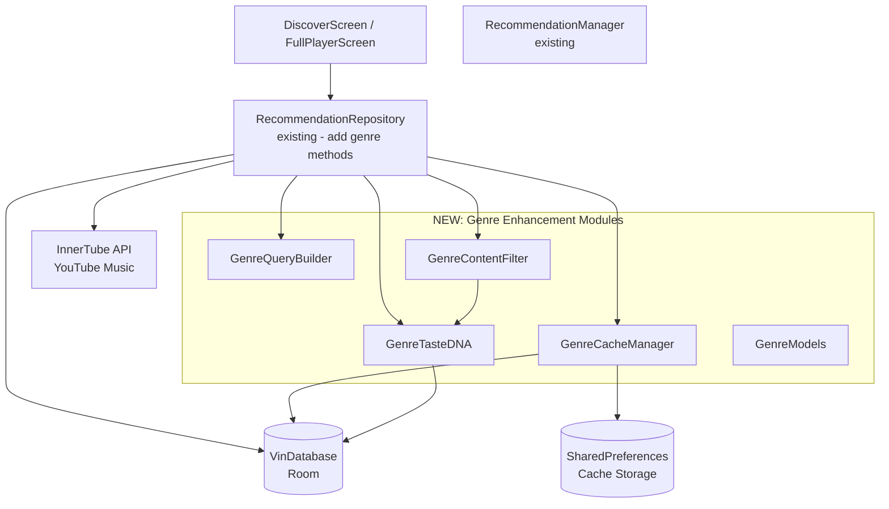
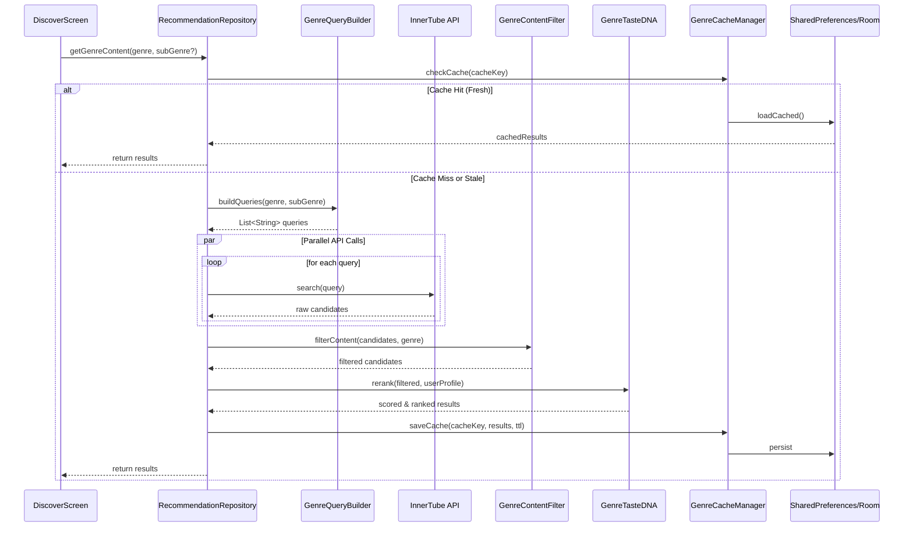

# Design Document: Pro Genre Enhancements

## Overview

The Pro Genre Enhancements feature transforms VinMusic's existing genre system by adding premium, personalized UI/UX elements that give each genre (Rap/Hip-Hop, K-Pop, 90s Hits, Indie) a unique visual personality and intelligent content discovery. This enhancement leverages a **hybrid filtering architecture** combining YouTube Music API queries with local TasteDNA-based reranking and caching.

### Design Philosophy

This design follows a **modular, production-safe approach**:

- **Separation of Concerns**: Each module has a single, well-defined responsibility
- **Incremental Implementation**: App compiles after each module addition
- **Testability**: Pure functions and dependency injection enable comprehensive testing
- **No Schema Changes**: Uses existing VinDatabase Room schema
- **Minimal Existing Code Impact**: Only adds new modules, minimal changes to existing files
- **Cache-First Strategy**: Reduces API calls, improves performance, supports offline graceful degradation

### Key Architectural Principles

1. **Modular Helper Classes**: `GenreQueryBuilder`, `GenreContentFilter`, `GenreTasteDNA`, `GenreCacheManager` instead of monolithic implementations
2. **Reusable Components**: Filter chains, scoring engines, and cache layers work across all genres
3. **Graceful Degradation**: Cold-start behavior without personalization, stale cache fallbacks
4. **Performance-Oriented**: Async operations, lazy loading, configurable TTL caching
5. **Existing Pattern Compliance**: Follows RecommendationManager.kt and RecommendationRepository.kt patterns

## Architecture

### System Context



### Data Flow: Hybrid Content Discovery Pipeline



### Module Responsibilities

| Module | Responsibility | Pure/Stateful |
|--------|---------------|---------------|
| **GenreQueryBuilder** | Generates specialized InnerTube API queries per genre/sub-genre | Pure |
| **GenreContentFilter** | Applies content quality filters (view count, duration, official/remix detection) | Pure |
| **GenreTasteDNA** | Scores and reranks content based on user listening history | Stateful (reads DB) |
| **GenreCacheManager** | Manages TTL-based caching with SharedPreferences + Room | Stateful |
| **GenreModels** | Lightweight data classes for genre-specific data | Data |

## Components and Interfaces

### 1. GenreModels.kt (Data Classes)

**Location**: `app/src/main/kotlin/com/vinmusic/recommendation/genre/GenreModels.kt`

```kotlin
package com.vinmusic.recommendation.genre

import com.vinmusic.innertube.VideoItem

/**
 * Represents a genre category with its configuration
 */
data class GenreConfig(
    val id: String,
    val displayName: String,
    val subGenres: List<String>,
    val primaryColor: String,
    val secondaryColor: String,
    val visualizerType: VisualizerType
)

enum class VisualizerType {
    VINYL,      // Default for K-Pop, Indie
    BASS,       // Rap/Hip-Hop
    CASSETTE    // 90s Hits
}

/**
 * Represents a scored content item after filtering and reranking
 */
data class ScoredContent(
    val videoItem: VideoItem,
    val score: Double,
    val reasons: List<String>  // e.g., ["Genre Match", "TasteDNA 0.85", "Official"]
)

/**
 * Cache entry with TTL metadata
 */
data class GenreCacheEntry(
    val cacheKey: String,
    val content: List<VideoItem>,
    val timestamp: Long,
    val ttlMillis: Long
) {
    fun isExpired(): Boolean = System.currentTimeMillis() - timestamp > ttlMillis
    fun isFresh(): Boolean = !isExpired()
    fun staleness(): Float = 
        ((System.currentTimeMillis() - timestamp).toFloat() / ttlMillis.toFloat()).coerceIn(0f, 1f)
}

/**
 * User's TasteDNA profile for genre-specific personalization
 */
data class GenreTasteProfile(
    val topGenres: Map<String, Double>,           // Genre -> affinity score
    val topMoods: Map<String, Double>,             // Mood -> affinity score
    val preferredArtists: Set<String>,             // Artist names (normalized)
    val skippedArtists: Set<String>,               // Artists with skip rate > 50%
    val recentlyPlayedArtists: Set<String>,        // Last 7 days
    val excludedVideoIds: Set<String>,             // Already played in timeframe
    val preferredLanguages: Map<String, Double>    // Language -> affinity
)

/**
 * Filter configuration per genre
 */
data class GenreFilterConfig(
    val maxViewCount: Long? = null,               // For "Undiscovered" content
    val minDurationSeconds: Int = 90,
    val maxDurationSeconds: Int = 480,
    val excludeKeywords: List<String> = emptyList(),
    val requireKeywords: List<String> = emptyList(),
    val maxSameArtist: Int = 2,
    val requireOfficial: Boolean = false
)

/**
 * Query template for genre-specific searches
 */
data class GenreQueryTemplate(
    val genre: String,
    val subGenre: String? = null,
    val templates: List<String>,
    val weight: Double = 1.0
)
```

### 2. GenreQueryBuilder.kt (Query Generation)

**Location**: `app/src/main/kotlin/com/vinmusic/recommendation/genre/GenreQueryBuilder.kt`

**Responsibility**: Generates specialized, targeted InnerTube API search queries optimized for each genre and sub-genre.

```kotlin
package com.vinmusic.recommendation.genre

/**
 * Pure query builder for genre-specific InnerTube API searches.
 * 
 * This module is PURE and stateless - no database access, no side effects.
 * All query generation logic is deterministic and testable.
 */
object GenreQueryBuilder {
    
    /**
     * Builds optimized search queries for Rap/Hip-Hop genre
     */
    fun buildRapQueries(subGenre: String?): List<String> {
        val baseQueries = when (subGenre?.lowercase()) {
            "trap" -> listOf(
                "trap music hits 2025",
                "trap rap popular songs",
                "trap beats new releases"
            )
            "old school" -> listOf(
                "old school hip hop classics",
                "90s rap hits golden era",
                "classic hip hop anthems"
            )
            "desi hip-hop" -> listOf(
                "desi hip hop 2025",
                "hindi rap songs divine kr\$na",
                "indian hip hop new releases"
            )
            "uk drill" -> listOf(
                "uk drill 2025",
                "uk drill popular hits",
                "uk drill new music"
            )
            else -> listOf(
                "rap hip hop hits 2025",
                "popular hip hop music",
                "rap new releases 2025"
            )
        }
        return baseQueries
    }
    
    /**
     * Builds artist spotlight queries for Rap genre
     */
    fun buildRapArtistQueries(): List<String> = listOf(
        "kendrick lamar official music",
        "divine rapper official songs",
        "kr\$na official tracks",
        "eminem official music",
        "trending rap artists 2025",
        "popular hip hop rappers"
    )
    
    /**
     * Builds queries for K-Pop content
     */
    fun buildKPopQueries(contentType: String?): List<String> {
        return when (contentType?.lowercase()) {
            "dance practice" -> listOf(
                "kpop dance practice official",
                "choreography studio choom",
                "dance practice video"
            )
            "live stage" -> listOf(
                "kpop live performance music show",
                "comeback stage music bank",
                "kpop live stage inkigayo"
            )
            "trending groups" -> listOf(
                "bts official music",
                "blackpink official songs",
                "newjeans official tracks",
                "stray kids official music"
            )
            "top soloists" -> listOf(
                "jungkook official songs",
                "iu official music",
                "taeyeon official tracks"
            )
            else -> listOf(
                "kpop hits 2025",
                "kpop popular songs",
                "kpop new releases"
            )
        }
    }
    
    /**
     * Builds queries for 90s Hits by specific year
     */
    fun build90sQueries(year: Int?): List<String> {
        val targetYear = year ?: 1995
        return listOf(
            "$targetYear hits songs",
            "top songs $targetYear music",
            "popular music $targetYear",
            "best of $targetYear hits"
        )
    }
    
    /**
     * Builds queries for Indie Undiscovered content
     */
    fun buildIndieUndiscoveredQueries(): List<String> = listOf(
        "indie unsigned artist new",
        "underrated indie songs 2025",
        "new indie music hidden gems",
        "indie discoveries underground"
    )
    
    /**
     * Builds queries for Indie Acoustic content
     */
    fun buildIndieAcousticQueries(): List<String> = listOf(
        "indie acoustic session live",
        "unplugged indie performance",
        "acoustic indie official",
        "stripped indie songs"
    )
    
    /**
     * Generic query builder with template substitution
     */
    fun buildFromTemplate(template: GenreQueryTemplate, vars: Map<String, String> = emptyMap()): List<String> {
        return template.templates.map { query ->
            var result = query
            vars.forEach { (key, value) ->
                result = result.replace("{$key}", value)
            }
            result
        }
    }
}
```

### 3. GenreContentFilter.kt (Content Quality Filtering)

**Location**: `app/src/main/kotlin/com/vinmusic/recommendation/genre/GenreContentFilter.kt`

**Responsibility**: Applies reusable filter chains to remove low-quality content (compilations, reactions, unofficial uploads).

```kotlin
package com.vinmusic.recommendation.genre

import com.vinmusic.innertube.VideoItem
import com.vinmusic.recommendation.RecommendationManager
import java.util.Locale

/**
 * Pure content filtering module for genre-specific quality control.
 * 
 * This module is PURE - no side effects, no database access.
 * All filters are composable and testable.
 */
object GenreContentFilter {
    
    /**
     * Master filter pipeline - applies all standard quality filters
     */
    fun filterContent(
        candidates: List<VideoItem>,
        config: GenreFilterConfig
    ): List<VideoItem> {
        return candidates
            .asSequence()
            .filter { !isCompilation(it) }
            .filter { !isNonMusic(it) }
            .filter { isValidDuration(it, config.minDurationSeconds, config.maxDurationSeconds) }
            .filter { !hasExcludedKeywords(it, config.excludeKeywords) }
            .filter { config.maxViewCount == null || hasLowViewCount(it, config.maxViewCount) }
            .filter { !config.requireOfficial || isOfficial(it) }
            .toList()
    }
    
    /**
     * Checks if content is a compilation/mashup/mix
     */
    fun isCompilation(item: VideoItem): Boolean {
        return RecommendationManager.isCompilationTrack(item.title, item.durationText)
    }
    
    /**
     * Checks if content is non-music (reaction, tutorial, etc.)
     */
    fun isNonMusic(item: VideoItem): Boolean {
        return RecommendationManager.isNonMusicVideo(item.title, item.author)
    }
    
    /**
     * Checks if content is unofficial (remix, cover, fan-made)
     */
    fun isUnofficial(item: VideoItem): Boolean {
        return RecommendationManager.isUnofficialContent(item.title, item.author)
    }
    
    /**
     * Checks if content is from official artist channel
     */
    fun isOfficial(item: VideoItem): Boolean {
        return RecommendationManager.isOfficialArtistChannel(item.title, item.author)
    }
    
    /**
     * Validates duration is within acceptable range
     */
    fun isValidDuration(item: VideoItem, minSeconds: Int, maxSeconds: Int): Boolean {
        val parts = item.durationText.split(":")
        val totalSeconds = when (parts.size) {
            3 -> {
                // HH:MM:SS format
                val hours = parts[0].toIntOrNull() ?: 0
                val mins = parts[1].toIntOrNull() ?: 0
                val secs = parts[2].toIntOrNull() ?: 0
                hours * 3600 + mins * 60 + secs
            }
            2 -> {
                // MM:SS format
                val mins = parts[0].toIntOrNull() ?: 0
                val secs = parts[1].toIntOrNull() ?: 0
                mins * 60 + secs
            }
            else -> 180 // Default 3 minutes if parsing fails
        }
        return totalSeconds in minSeconds..maxSeconds
    }
    
    /**
     * Checks if title/author contains excluded keywords
     */
    fun hasExcludedKeywords(item: VideoItem, keywords: List<String>): Boolean {
        val text = "${item.title} ${item.author}".lowercase(Locale.ROOT)
        return keywords.any { text.contains(it.lowercase()) }
    }
    
    /**
     * Simulated view count check (YouTube API doesn't always provide this)
     * For now, return false (accept all) - can be enhanced with metadata extraction
     */
    fun hasLowViewCount(item: VideoItem, maxViews: Long): Boolean {
        // TODO: Extract view count from metadata when available
        // For MVP, we rely on query quality and other filters
        return true
    }
    
    /**
     * Genre-specific filter presets
     */
    object Presets {
        val RAP = GenreFilterConfig(
            minDurationSeconds = 90,
            maxDurationSeconds = 480,
            excludeKeywords = listOf("slowed", "reverb", "8D", "1 hour", "type beat"),
            maxSameArtist = 3
        )
        
        val KPOP = GenreFilterConfig(
            minDurationSeconds = 120,
            maxDurationSeconds = 360,
            excludeKeywords = listOf("random play dance", "fan edit"),
            maxSameArtist = 2
        )
        
        val NINETIES = GenreFilterConfig(
            minDurationSeconds = 120,
            maxDurationSeconds = 420,
            excludeKeywords = listOf("remastered", "remix", "cover", "tribute", "karaoke"),
            requireOfficial = true,
            maxSameArtist = 1
        )
        
        val INDIE_UNDISCOVERED = GenreFilterConfig(
            maxViewCount = 1_000_000,
            minDurationSeconds = 90,
            maxDurationSeconds = 480,
            excludeKeywords = listOf("remix", "cover", "live"),
            maxSameArtist = 1
        )
        
        val INDIE_ACOUSTIC = GenreFilterConfig(
            minDurationSeconds = 120,
            maxDurationSeconds = 420,
            excludeKeywords = listOf("full band", "electric", "remix"),
            maxSameArtist = 2
        )
    }
    
    /**
     * Applies artist diversity constraint
     */
    fun applyArtistDiversity(items: List<VideoItem>, maxPerArtist: Int): List<VideoItem> {
        val result = mutableListOf<VideoItem>()
        val artistCounts = mutableMapOf<String, Int>()
        
        for (item in items) {
            val artist = item.author.lowercase(Locale.ROOT).trim()
            val count = artistCounts.getOrDefault(artist, 0)
            if (count < maxPerArtist) {
                result.add(item)
                artistCounts[artist] = count + 1
            }
        }
        return result
    }
    
    /**
     * Removes duplicate/similar titles using Levenshtein distance
     */
    fun deduplicateSimilar(items: List<VideoItem>): List<VideoItem> {
        val result = mutableListOf<VideoItem>()
        for (item in items) {
            val isDuplicate = result.any { existing ->
                RecommendationManager.isTooSimilar(existing.title, item.title)
            }
            if (!isDuplicate) {
                result.add(item)
            }
        }
        return result
    }
}
```

### 4. GenreTasteDNA.kt (Personalization Engine)

**Location**: `app/src/main/kotlin/com/vinmusic/recommendation/genre/GenreTasteDNA.kt`

**Responsibility**: Scores and reranks content based on user's listening history and preferences.

```kotlin
package com.vinmusic.recommendation.genre

import android.util.Log
import com.vinmusic.data.db.VinDatabase
import com.vinmusic.innertube.VideoItem
import com.vinmusic.recommendation.RecommendationManager
import kotlinx.coroutines.Dispatchers
import kotlinx.coroutines.withContext
import java.util.Locale

/**
 * TasteDNA-based personalization engine for genre content.
 * 
 * This module reads from database but performs no writes.
 * All scoring logic is deterministic given a profile.
 */
class GenreTasteDNA(private val db: VinDatabase) {
    
    private val TAG = "GenreTasteDNA"
    
    /**
     * Builds user's genre-specific taste profile from listening history
     */
    suspend fun buildProfile(genre: String? = null): GenreTasteProfile = withContext(Dispatchers.IO) {
        val signals = db.interactionSignalDao().getAll()
        val history = db.historyDao().getAllHistory()
        
        val genreScores = mutableMapOf<String, Double>()
        val moodScores = mutableMapOf<String, Double>()
        val langScores = mutableMapOf<String, Double>()
        val preferredArtists = mutableSetOf<String>()
        val skippedArtists = mutableSetOf<String>()
        val recentArtists = mutableSetOf<String>()
        val excludedIds = mutableSetOf<String>()
        
        val sevenDaysAgo = System.currentTimeMillis() - (7 * 24 * 60 * 60 * 1000L)
        val fourteenDaysAgo = System.currentTimeMillis() - (14 * 24 * 60 * 60 * 1000L)
        
        // Process interaction signals
        for (sig in signals) {
            val fakeItem = VideoItem(sig.videoId, sig.title, sig.author, sig.durationText)
            val meta = RecommendationManager.inferMetadata(fakeItem)
            
            // Skip if genre filtering is enabled and doesn't match
            if (genre != null && meta.genre != genre) continue
            
            // Calculate affinity score
            var score = 0.0
            score += sig.completeCount * 5.0
            score += sig.repeatCount * 6.0
            if (sig.isLiked) score += 10.0
            if (sig.isDownloaded) score += 8.0
            score -= sig.skip20sCount * 6.0
            
            if (score > 6.0) {
                preferredArtists.add(sig.author.lowercase(Locale.ROOT).trim())
            }
            
            // Track skip patterns
            if (sig.skip20sCount >= 2 || sig.skipCount >= 4) {
                if (sig.skipCount > sig.playCount) {
                    skippedArtists.add(sig.author.lowercase(Locale.ROOT).trim())
                }
            }
            
            // Recently played
            if (sig.lastPlayedAt > sevenDaysAgo) {
                recentArtists.add(sig.author.lowercase(Locale.ROOT).trim())
            }
            
            // Exclude recently played tracks
            if (sig.lastPlayedAt > fourteenDaysAgo) {
                excludedIds.add(sig.videoId)
            }
            
            // Aggregate genre/mood/language scores
            if (score > 0) {
                genreScores[meta.genre] = (genreScores[meta.genre] ?: 0.0) + score
                moodScores[meta.mood] = (moodScores[meta.mood] ?: 0.0) + score
                langScores[meta.language] = (langScores[meta.language] ?: 0.0) + score
            }
        }
        
        // Process recent history
        for (entry in history.take(50)) {
            if (entry.playedAt > fourteenDaysAgo) {
                excludedIds.add(entry.videoId)
            }
            if (entry.playedAt > sevenDaysAgo) {
                recentArtists.add(entry.author.lowercase(Locale.ROOT).trim())
            }
        }
        
        Log.d(TAG, "Built TasteDNA profile: ${genreScores.size} genres, ${preferredArtists.size} artists, ${excludedIds.size} excluded")
        
        GenreTasteProfile(
            topGenres = genreScores,
            topMoods = moodScores,
            preferredArtists = preferredArtists,
            skippedArtists = skippedArtists,
            recentlyPlayedArtists = recentArtists,
            excludedVideoIds = excludedIds,
            preferredLanguages = langScores
        )
    }
    
    /**
     * Scores a single item against user's taste profile
     * Returns score 0.0-1.0
     */
    fun scoreItem(item: VideoItem, profile: GenreTasteProfile): Double {
        val meta = RecommendationManager.inferMetadata(item)
        val artist = item.author.lowercase(Locale.ROOT).trim()
        
        var score = 0.5 // Base score
        
        // Genre match (30%)
        val genreTotal = profile.topGenres.values.sum()
        if (genreTotal > 0) {
            val genreAffinity = (profile.topGenres[meta.genre] ?: 0.0) / genreTotal
            score += genreAffinity * 0.30
        }
        
        // Mood match (20%)
        val moodTotal = profile.topMoods.values.sum()
        if (moodTotal > 0) {
            val moodAffinity = (profile.topMoods[meta.mood] ?: 0.0) / moodTotal
            score += moodAffinity * 0.20
        }
        
        // Artist match (25%)
        if (profile.preferredArtists.contains(artist)) {
            score += 0.25
        } else if (profile.recentlyPlayedArtists.contains(artist)) {
            score += 0.15
        }
        
        // Language match (10%)
        val langTotal = profile.preferredLanguages.values.sum()
        if (langTotal > 0) {
            val langAffinity = (profile.preferredLanguages[meta.language] ?: 0.0) / langTotal
            score += langAffinity * 0.10
        }
        
        // Official bonus (15%)
        if (meta.isOfficial) {
            score += 0.15
        }
        
        // Penalties
        if (profile.skippedArtists.contains(artist)) {
            score -= 0.25
        }
        
        if (profile.excludedVideoIds.contains(item.videoId)) {
            score -= 0.50
        }
        
        return score.coerceIn(0.0, 1.0)
    }
    
    /**
     * Scores and reranks a list of items by TasteDNA similarity
     */
    fun rerankByTaste(items: List<VideoItem>, profile: GenreTasteProfile): List<ScoredContent> {
        return items.map { item ->
            val score = scoreItem(item, profile)
            val reasons = buildScoringReasons(item, profile, score)
            ScoredContent(item, score, reasons)
        }.sortedByDescending { it.score }
    }
    
    /**
     * Filters out already-played and skipped content
     */
    fun filterExcluded(items: List<VideoItem>, profile: GenreTasteProfile): List<VideoItem> {
        return items.filter { item ->
            val artist = item.author.lowercase(Locale.ROOT).trim()
            !profile.excludedVideoIds.contains(item.videoId) &&
            !profile.skippedArtists.contains(artist)
        }
    }
    
    /**
     * Cold-start mode: returns items without personalization penalty
     */
    fun isColdStart(profile: GenreTasteProfile): Boolean {
        return profile.topGenres.isEmpty() || profile.preferredArtists.isEmpty()
    }
    
    private fun buildScoringReasons(item: VideoItem, profile: GenreTasteProfile, score: Double): List<String> {
        val reasons = mutableListOf<String>()
        val meta = RecommendationManager.inferMetadata(item)
        val artist = item.author.lowercase(Locale.ROOT).trim()
        
        if (profile.topGenres.containsKey(meta.genre)) {
            reasons.add("Genre Match: ${meta.genre}")
        }
        if (profile.preferredArtists.contains(artist)) {
            reasons.add("Favorite Artist")
        }
        if (meta.isOfficial) {
            reasons.add("Official")
        }
        reasons.add("TasteDNA: %.2f".format(score))
        
        return reasons
    }
}
```

### 5. GenreCacheManager.kt (Cache Layer)

**Location**: `app/src/main/kotlin/com/vinmusic/recommendation/genre/GenreCacheManager.kt`

**Responsibility**: Manages TTL-based caching with SharedPreferences for lightweight persistence.


```kotlin
package com.vinmusic.recommendation.genre

import android.content.Context
import android.content.SharedPreferences
import android.util.Log
import com.google.gson.Gson
import com.google.gson.reflect.TypeToken
import com.vinmusic.innertube.VideoItem

/**
 * Lightweight cache manager for genre content using SharedPreferences.
 * 
 * Provides TTL-based caching, staleness detection, and LRU eviction.
 */
class GenreCacheManager(context: Context) {
    
    private val prefs: SharedPreferences = 
        context.getSharedPreferences("genre_cache_v1", Context.MODE_PRIVATE)
    private val gson = Gson()
    private val TAG = "GenreCacheManager"
    
    companion object {
        const val MAX_CACHE_ENTRIES = 500
        const val DEFAULT_TTL_MS = 12 * 60 * 60 * 1000L  // 12 hours
    }
    
    /**
     * Saves content to cache with TTL
     */
    fun save(cacheKey: String, content: List<VideoItem>, ttlMillis: Long = DEFAULT_TTL_MS) {
        try {
            val entry = GenreCacheEntry(
                cacheKey = cacheKey,
                content = content,
                timestamp = System.currentTimeMillis(),
                ttlMillis = ttlMillis
            )
            val json = gson.toJson(entry)
            prefs.edit().putString(cacheKey, json).apply()
            
            // Update access timestamp for LRU
            updateAccessTime(cacheKey)
            
            // Evict old entries if over limit
            evictIfNeeded()
            
            Log.d(TAG, "Cached $cacheKey with ${content.size} items, TTL=${ttlMillis}ms")
        } catch (e: Exception) {
            Log.e(TAG, "Failed to save cache for $cacheKey: ${e.message}")
        }
    }
    
    /**
     * Loads content from cache if fresh
     * Returns null if cache miss or expired
     */
    fun load(cacheKey: String): List<VideoItem>? {
        try {
            val json = prefs.getString(cacheKey, null) ?: return null
            val type = object : TypeToken<GenreCacheEntry>() {}.type
            val entry: GenreCacheEntry = gson.fromJson(json, type) ?: return null
            
            if (entry.isExpired()) {
                Log.d(TAG, "Cache expired for $cacheKey")
                prefs.edit().remove(cacheKey).apply()
                return null
            }
            
            updateAccessTime(cacheKey)
            Log.d(TAG, "Cache hit for $cacheKey with ${entry.content.size} items")
            return entry.content
        } catch (e: Exception) {
            Log.e(TAG, "Failed to load cache for $cacheKey: ${e.message}")
            return null
        }
    }
    
    /**
     * Loads content even if stale (for fallback scenarios)
     */
    fun loadStale(cacheKey: String): Pair<List<VideoItem>, Boolean>? {
        try {
            val json = prefs.getString(cacheKey, null) ?: return null
            val type = object : TypeToken<GenreCacheEntry>() {}.type
            val entry: GenreCacheEntry = gson.fromJson(json, type) ?: return null
            
            val isStale = entry.isExpired()
            return entry.content to isStale
        } catch (e: Exception) {
            return null
        }
    }
    
    /**
     * Checks if cache exists and is fresh
     */
    fun isFresh(cacheKey: String): Boolean {
        val json = prefs.getString(cacheKey, null) ?: return false
        val type = object : TypeToken<GenreCacheEntry>() {}.type
        val entry: GenreCacheEntry = gson.fromJson(json, type) ?: return false
        return entry.isFresh()
    }
    
    /**
     * Returns staleness factor 0.0 (fresh) to 1.0 (expired+)
     */
    fun staleness(cacheKey: String): Float {
        val json = prefs.getString(cacheKey, null) ?: return 1.0f
        val type = object : TypeToken<GenreCacheEntry>() {}.type
        val entry: GenreCacheEntry = gson.fromJson(json, type) ?: return 1.0f
        return entry.staleness()
    }
    
    /**
     * Invalidates cache for a specific key
     */
    fun invalidate(cacheKey: String) {
        prefs.edit().remove(cacheKey).apply()
        prefs.edit().remove("${cacheKey}_access").apply()
    }
    
    /**
     * Clears all genre caches
     */
    fun clearAll() {
        prefs.edit().clear().apply()
        Log.d(TAG, "Cleared all genre caches")
    }
    
    /**
     * Returns cache statistics
     */
    fun getStats(): CacheStats {
        val allKeys = prefs.all.keys.filter { !it.endsWith("_access") }
        var totalEntries = 0
        var totalItems = 0
        var freshCount = 0
        var staleCount = 0
        
        for (key in allKeys) {
            try {
                val json = prefs.getString(key, null) ?: continue
                val type = object : TypeToken<GenreCacheEntry>() {}.type
                val entry: GenreCacheEntry = gson.fromJson(json, type) ?: continue
                
                totalEntries++
                totalItems += entry.content.size
                if (entry.isFresh()) freshCount++ else staleCount++
            } catch (e: Exception) {
                // Skip malformed entries
            }
        }
        
        return CacheStats(totalEntries, totalItems, freshCount, staleCount)
    }
    
    private fun updateAccessTime(cacheKey: String) {
        prefs.edit().putLong("${cacheKey}_access", System.currentTimeMillis()).apply()
    }
    
    private fun evictIfNeeded() {
        val allKeys = prefs.all.keys.filter { !it.endsWith("_access") }
        if (allKeys.size <= MAX_CACHE_ENTRIES) return
        
        // LRU eviction - remove oldest accessed entries
        val accessTimes = allKeys.associateWith { key ->
            prefs.getLong("${key}_access", 0L)
        }
        
        val toEvict = accessTimes.entries
            .sortedBy { it.value }
            .take(allKeys.size - MAX_CACHE_ENTRIES)
        
        val editor = prefs.edit()
        toEvict.forEach { (key, _) ->
            editor.remove(key)
            editor.remove("${key}_access")
        }
        editor.apply()
        
        Log.d(TAG, "Evicted ${toEvict.size} LRU cache entries")
    }
}

data class CacheStats(
    val totalEntries: Int,
    val totalItems: Int,
    val freshCount: Int,
    val staleCount: Int
) {
    val hitRate: Float get() = if (totalEntries > 0) freshCount.toFloat() / totalEntries else 0f
}
```

## Data Models

### Genre Configuration Constants

```kotlin
// In GenreModels.kt

object GenreConstants {
    val RAP = GenreConfig(
        id = "rap",
        displayName = "Rap/Hip-Hop",
        subGenres = listOf("Trap", "Old School", "Desi Hip-Hop", "UK Drill"),
        primaryColor = "#FF1744",
        secondaryColor = "#D50000",
        visualizerType = VisualizerType.BASS
    )
    
    val KPOP = GenreConfig(
        id = "kpop",
        displayName = "K-Pop",
        subGenres = emptyList(),
        primaryColor = "#E91E63",
        secondaryColor = "#AD1457",
        visualizerType = VisualizerType.VINYL
    )
    
    val NINETIES = GenreConfig(
        id = "90s",
        displayName = "90s Hits",
        subGenres = (1990..1999).map { it.toString() },
        primaryColor = "#FF6F00",
        secondaryColor = "#E65100",
        visualizerType = VisualizerType.CASSETTE
    )
    
    val INDIE = GenreConfig(
        id = "indie",
        displayName = "Indie",
        subGenres = listOf("Undiscovered", "Acoustic"),
        primaryColor = "#00BFA5",
        secondaryColor = "#00897B",
        visualizerType = VisualizerType.VINYL
    )
    
    val ALL_GENRES = listOf(RAP, KPOP, NINETIES, INDIE)
}
```

### Cache Key Strategy

```kotlin
object CacheKeys {
    fun rapSubGenre(subGenre: String) = "rap_${subGenre.lowercase()}_content"
    fun rapArtistSpotlight() = "rap_artist_spotlight"
    fun kpopContent(type: String) = "kpop_${type.lowercase()}_content"
    fun nineties(year: Int) = "90s_${year}_content"
    fun indieUndiscovered() = "indie_undiscovered_content"
    fun indieAcoustic() = "indie_acoustic_content"
}
```

## Correctness Properties

*A property is a characteristic or behavior that should hold true across all valid executions of a system—essentially, a formal statement about what the system should do. Properties serve as the bridge between human-readable specifications and machine-verifiable correctness guarantees.*

**Note on Property-Based Testing for This Feature:**

This feature involves a hybrid of:
1. **Pure logic modules** (GenreQueryBuilder, GenreContentFilter) — suitable for property-based testing
2. **External API integration** (InnerTube queries) — NOT suitable for property-based testing
3. **UI rendering and animations** (visualizers, gradients) — NOT suitable for property-based testing
4. **Configuration and caching** — suitable for example-based testing

We will apply property-based testing ONLY to the pure logic modules and use integration tests + example-based tests for API and UI components.

### Property Reflection

After analyzing all acceptance criteria, the following properties were identified as testable through property-based testing. Initial analysis revealed some redundancy:

- **Properties 6 and 7** both test filtering/exclusion behavior but at different levels (exclusion by ID vs deduplication by similarity)
- **Property 2** (filter idempotence) already validates that filters work correctly, which partially covers some aspects of Properties 6 and 7

However, each property provides unique validation value:
- Property 2 validates filters are stable (idempotent)
- Property 6 validates exclusion logic based on user history
- Property 7 validates deduplication based on content similarity

These are complementary rather than redundant, so all properties are retained.

### Property 1: Query Generation Determinism

*For any* genre and sub-genre combination, calling `GenreQueryBuilder.buildRapQueries(subGenre)` (or equivalent for other genres) multiple times with the same input SHALL produce identical query lists.

**Validates: Requirements 1.5, 6.3, 8.5, 10.2, 11.2**

### Property 2: Filter Idempotence

*For any* list of VideoItems and GenreFilterConfig, applying `GenreContentFilter.filterContent(items, config)` twice SHALL produce the same result as applying it once (applying filters is idempotent).

**Validates: Requirements 1.6, 1.7, 6.4, 8.6, 10.3, 10.4, 19.1, 20.1**

### Property 3: Artist Diversity Constraint

*For any* list of VideoItems and maxPerArtist count N, the result of `GenreContentFilter.applyArtistDiversity(items, N)` SHALL contain at most N songs from any single artist.

**Validates: Requirements 1.9, 8.11, 10.8, 19.4, 20.8**

### Property 4: TasteDNA Scoring Range

*For any* VideoItem and GenreTasteProfile, the result of `GenreTasteDNA.scoreItem(item, profile)` SHALL be a value between 0.0 and 1.0 inclusive.

**Validates: Requirements 17.6, 18.2, 18.3, 18.4, 18.5**

### Property 5: Cache Freshness Invariant

*For any* cache entry saved with TTL T milliseconds, querying `GenreCacheManager.isFresh(key)` at time T-1 milliseconds after creation SHALL return true, and at time T+1 milliseconds SHALL return false.

**Validates: Requirements 15.6, 15.7, 17.8**

### Property 6: Excluded Content Filtering

*For any* list of VideoItems and GenreTasteProfile containing excluded video IDs, `GenreTasteDNA.filterExcluded(items, profile)` SHALL return a list containing none of the excluded IDs.

**Validates: Requirements 1.9, 8.10, 10.7, 18.6, 19.8**

### Property 7: Deduplication Completeness

*For any* list of VideoItems containing duplicate videoIds or similar titles (Levenshtein similarity > 0.70), `GenreContentFilter.deduplicateSimilar(items)` SHALL return a list where no two items have the same videoId or similar titles.

**Validates: Requirements 19.8, 20.7**

### Property 8: Cache LRU Eviction Order

*For any* sequence of cache operations that causes the cache size to exceed MAX_CACHE_ENTRIES, the evicted entries SHALL be those with the oldest access timestamps (least recently used).

**Validates: Requirements 15.8**

### Property 9: Content Duration Validation

*For any* VideoItem and duration bounds (minSeconds, maxSeconds), `GenreContentFilter.isValidDuration(item, minSeconds, maxSeconds)` SHALL return true if and only if the parsed duration falls within [minSeconds, maxSeconds].

**Validates: Requirements 10.5, 19.3**

### Property 10: Visualizer Selection Determinism

*For any* genre tag string, the visualizer selection logic SHALL consistently map "Rap"/"Hip-Hop" to BASS visualizer, "90s" to CASSETTE visualizer, and all others to VINYL visualizer.

**Validates: Requirements 13.1, 13.2, 13.3, 13.4**

## Error Handling

### API Failure Scenarios

1. **InnerTube API Timeout/Network Failure**
   - **Behavior**: Check cache for stale results
   - **Fallback**: Return stale cache with staleness indicator
   - **UI**: Display "Offline Mode - Showing cached results" banner
   - **Implementation**: Try-catch around InnerTube calls in RecommendationRepository

2. **InnerTube API Returns Empty Results**
   - **Behavior**: Attempt fallback queries (broader search terms)
   - **Fallback**: Show genre-agnostic recommendations from RecommendationManager
   - **UI**: Display "No results found - Showing similar content" message

3. **Cache Corruption**
   - **Behavior**: Log error, clear corrupted key, proceed with API call
   - **Recovery**: Gson parsing exceptions trigger automatic cache invalidation

### Cold Start Scenarios

1. **User with < 10 Total Plays**
   - **Behavior**: Skip TasteDNA reranking, use genre-specific defaults
   - **Strategy**: Return top results from InnerTube queries without personalization penalty
   - **Flag**: `GenreTasteDNA.isColdStart(profile)` returns true

2. **User with No Genre Match**
   - **Behavior**: Use global affinity scores instead of genre-specific
   - **Fallback**: Prioritize official content, popular items

### Data Integrity

1. **Missing Metadata Fields**
   - **Behavior**: Use safe defaults (e.g., duration = "3:00" if missing)
   - **Implementation**: Null-safe operators in Kotlin

2. **Invalid Duration Format**
   - **Behavior**: Parse robustly, default to 180 seconds on failure
   - **Implementation**: `GenreContentFilter.isValidDuration()` handles edge cases

### UI Error States

1. **Visualizer Rendering Failure**
   - **Behavior**: Fall back to default vinyl visualizer
   - **Recovery**: Try-catch around visualizer instantiation

2. **Gradient Animation Crash**
   - **Behavior**: Use static gradient colors
   - **Recovery**: Disable animation on subsequent launches

## Testing Strategy

### Unit Testing

**Test Targets**:
- `GenreQueryBuilder`: All query generation functions
- `GenreContentFilter`: All filter functions and presets
- `GenreTasteDNA`: Scoring logic (with mocked database)
- `GenreCacheManager`: Save/load/eviction logic (with test SharedPreferences)

**Example Test Cases**:
```kotlin
@Test
fun `rapQueries for trap subgenre contains trap keyword`() {
    val queries = GenreQueryBuilder.buildRapQueries("trap")
    assertTrue(queries.all { it.contains("trap", ignoreCase = true) })
}

@Test
fun `filterContent removes compilations`() {
    val items = listOf(
        VideoItem("1", "Top 20 Hits Mashup", "Channel", "45:00"),
        VideoItem("2", "Artist - Song Name", "Official", "3:30")
    )
    val config = GenreFilterConfig()
    val filtered = GenreContentFilter.filterContent(items, config)
    assertEquals(1, filtered.size)
    assertEquals("2", filtered[0].videoId)
}

@Test
fun `applyArtistDiversity respects max limit`() {
    val items = listOf(
        VideoItem("1", "Song 1", "Artist A", "3:00"),
        VideoItem("2", "Song 2", "Artist A", "3:00"),
        VideoItem("3", "Song 3", "Artist A", "3:00")
    )
    val result = GenreContentFilter.applyArtistDiversity(items, maxPerArtist = 2)
    assertEquals(2, result.size)
}
```

### Property-Based Testing

**Library**: Use **Kotest PropertyTesting** for Kotlin

**Configuration**: Minimum 100 iterations per property test

**Test Implementation**:

```kotlin
class GenreContentFilterPropertyTest : StringSpec({
    
    "Property 2: Filter Idempotence" {
        checkAll(100, Arb.list(Arb.videoItem(), 10..50)) { items ->
            val config = GenreFilterConfig()
            val once = GenreContentFilter.filterContent(items, config)
            val twice = GenreContentFilter.filterContent(once, config)
            once shouldBe twice
        }
    }
    
    "Property 3: Artist Diversity Constraint" {
        checkAll(100, Arb.list(Arb.videoItem(), 20..100), Arb.int(1..5)) { items, maxPerArtist ->
            val result = GenreContentFilter.applyArtistDiversity(items, maxPerArtist)
            val artistCounts = result.groupingBy { it.author }.eachCount()
            artistCounts.values.all { it <= maxPerArtist } shouldBe true
        }
    }
    
    "Property 4: TasteDNA Scoring Range" {
        checkAll(100, Arb.videoItem(), Arb.tasteProfile()) { item, profile ->
            val tasteDNA = GenreTasteDNA(mockDatabase)
            val score = tasteDNA.scoreItem(item, profile)
            score shouldBeGreaterThanOrEqual 0.0
            score shouldBeLessThanOrEqual 1.0
        }
    }
    
    "Property 5: Cache Freshness Invariant" {
        checkAll(100, Arb.string(5..20), Arb.list(Arb.videoItem(), 1..20), Arb.long(1000L..10000L)) { key, items, ttl ->
            val cacheManager = GenreCacheManager(testContext)
            cacheManager.save(key, items, ttl)
            
            // Just before expiry
            Thread.sleep(ttl - 100)
            cacheManager.isFresh(key) shouldBe true
            
            // Just after expiry
            Thread.sleep(200)
            cacheManager.isFresh(key) shouldBe false
        }
    }
})

// Custom Arb generators
fun Arb.Companion.videoItem(): Arb<VideoItem> = arbitrary {
    VideoItem(
        videoId = Arb.string(10..15).bind(),
        title = Arb.string(10..50).bind(),
        author = Arb.string(5..30).bind(),
        durationText = Arb.duration().bind()
    )
}

fun Arb.Companion.tasteProfile(): Arb<GenreTasteProfile> = arbitrary {
    GenreTasteProfile(
        topGenres = Arb.map(Arb.string(), Arb.double(0.0..1.0), 0..5).bind(),
        topMoods = Arb.map(Arb.string(), Arb.double(0.0..1.0), 0..5).bind(),
        preferredArtists = Arb.set(Arb.string(), 0..10).bind(),
        skippedArtists = Arb.set(Arb.string(), 0..5).bind(),
        recentlyPlayedArtists = Arb.set(Arb.string(), 0..8).bind(),
        excludedVideoIds = Arb.set(Arb.string(10..15), 0..20).bind(),
        preferredLanguages = Arb.map(Arb.string(), Arb.double(0.0..1.0), 0..3).bind()
    )
}
```

### Integration Testing

**Test Targets**:
- `RecommendationRepository.getGenreContent()` with real InnerTube API
- Cache warm/cold scenarios
- Error fallback chains

**Test Approach**:
- Use real API calls with network mocking for failure scenarios
- Test 1-2 examples per genre
- Verify end-to-end pipeline from query → filter → rerank → cache

### UI Testing

**Test Approach**:
- Compose UI tests for genre selection, sub-genre chips
- Screenshot tests for visualizers (Bass, Cassette, Vinyl)
- Visual regression tests for gradient animations
- Manual QA for performance (frame rate, smoothness)

**Not Property-Testable** (use example-based tests):
- Visualizer rendering
- Gradient animations
- Layout rendering
- User interactions

### Performance Testing

**Metrics to Track**:
- Cache hit rate (target: > 70%)
- API call latency (target: < 2s for first result)
- UI frame rate during animations (target: >= 50 FPS)
- Memory usage (target: < 50MB increase)

**Test Methodology**:
- Use Android Profiler for frame rate monitoring
- Log cache statistics after 100 operations
- Measure API response times over 10 queries

## Implementation Notes

### RecommendationRepository Integration

Add new methods to `RecommendationRepository.kt`:

```kotlin
suspend fun getGenreContent(
    genre: String,
    subGenre: String? = null,
    contentType: String? = null
): List<VideoItem> = withContext(Dispatchers.IO) {
    val cacheKey = buildCacheKey(genre, subGenre, contentType)
    val cacheManager = GenreCacheManager(context)
    
    // Try cache first
    val cached = cacheManager.load(cacheKey)
    if (cached != null && cached.isNotEmpty()) {
        return@withContext cached
    }
    
    // Build queries
    val queries = when (genre.lowercase()) {
        "rap" -> GenreQueryBuilder.buildRapQueries(subGenre)
        "kpop" -> GenreQueryBuilder.buildKPopQueries(contentType)
        "90s" -> GenreQueryBuilder.build90sQueries(subGenre?.toIntOrNull())
        "indie" -> if (subGenre == "Undiscovered") {
            GenreQueryBuilder.buildIndieUndiscoveredQueries()
        } else {
            GenreQueryBuilder.buildIndieAcousticQueries()
        }
        else -> emptyList()
    }
    
    // Fetch candidates
    val candidates = queries.flatMap { query ->
        try {
            InnerTube.search(query)
        } catch (e: Exception) {
            Log.e(TAG, "Query failed: $query", e)
            emptyList()
        }
    }.distinctBy { it.videoId }
    
    // Apply filters
    val filterConfig = getFilterConfig(genre, subGenre)
    val filtered = GenreContentFilter.filterContent(candidates, filterConfig)
    
    // TasteDNA reranking
    val tasteDNA = GenreTasteDNA(db)
    val profile = tasteDNA.buildProfile(genre)
    val scored = tasteDNA.rerankByTaste(filtered, profile)
    
    // Apply artist diversity
    val diversified = GenreContentFilter.applyArtistDiversity(
        scored.map { it.videoItem },
        filterConfig.maxSameArtist
    )
    
    // Cache results
    val ttl = getTTL(genre, subGenre)
    cacheManager.save(cacheKey, diversified, ttl)
    
    diversified
}
```

### DiscoverScreen Integration

Minimal changes to existing DiscoverScreen:

1. Add genre selection tabs
2. Display sub-genre chips when genre is selected
3. Call `RecommendationRepository.getGenreContent()` on selection
4. Display results in existing LazyRow/LazyColumn

### FullPlayerScreen Integration

Add conditional visualizer rendering:

```kotlin
val genre = currentSong?.let { RecommendationManager.inferMetadata(it).genre }
when (GenreConstants.ALL_GENRES.find { it.displayName == genre }?.visualizerType) {
    VisualizerType.BASS -> BassVisualizer(audioData)
    VisualizerType.CASSETTE -> CassetteVisualizer(isPlaying)
    else -> VinylVisualizer(isPlaying)
}
```

### SharedPreferences vs Room

**Decision**: Use SharedPreferences for cache storage (not Room)

**Rationale**:
- Lightweight, fast key-value storage
- No schema changes to VinDatabase
- Easy TTL management with JSON serialization
- Cache data is ephemeral (acceptable loss on app clear)

If cache persistence becomes critical, migrate to Room with `genre_cache` table in future iteration.

---

This design document provides a complete technical blueprint for implementing the Pro Genre Enhancements feature with emphasis on modularity, testability, and production safety. Each module is designed to be implemented incrementally while keeping the app functional at every stage.
