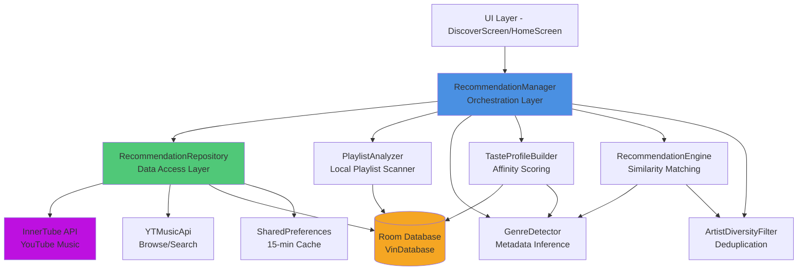

# Technical Design Document: Smart Playlist Recommendations

## Overview

This document specifies the technical design for an intelligent, multi-artist playlist recommendation system for the VinMusic Android app. The system analyzes user listening behavior, local playlists, and interaction signals to build a comprehensive taste profile, then generates diverse, high-quality music recommendations across multiple dimensions (Quick Picks, Genre Mixes, Smart Radio, Related Songs).

### Design Goals

1. **Diversity**: Prevent same-artist repetition by enforcing artist diversity filters
2. **Quality**: Filter out non-music content, compilations, and unofficial tracks
3. **Personalization**: Match user taste profile using multi-dimensional similarity scoring
4. **Performance**: Cache recommendations for 15 minutes to minimize API calls
5. **Cold Start Support**: Provide reasonable recommendations for new users
6. **Scalability**: Handle large playlists and interaction histories efficiently

### Key Features

- **Playlist Analysis**: Scan all local playlists to extract music preference patterns
- **Genre Detection**: Infer genres, moods, languages, and acoustic properties from metadata
- **Taste Profiling**: Build comprehensive user taste DNA with weighted artist/genre/mood preferences
- **Multi-Artist Recommendations**: Generate playlists with minimum 3 different artists
- **Smart Filtering**: Remove compilations, reaction videos, non-music content, unofficial tracks
- **Caching Strategy**: 15-minute cache for all recommendation types with disk persistence

## Architecture

### High-Level Component Diagram



### Component Responsibilities

| Component | Responsibility | Location |
|-----------|---------------|----------|
| **RecommendationManager** | High-level orchestration, taste profile building, scoring | `RecommendationManager.kt` |
| **RecommendationRepository** | Data access, API integration, caching | `RecommendationRepository.kt` |
| **PlaylistAnalyzer** | Scans local playlists, extracts song metadata | `RecommendationManager.buildTasteProfile()` |
| **GenreDetector** | Infers genre, mood, language, energy, tempo | `RecommendationManager.inferMetadata()` |
| **TasteProfileBuilder** | Builds TasteProfile from signals/playlists/history | `RecommendationManager.buildTasteProfile()` |
| **RecommendationEngine** | Generates recommendations, applies filters | `RecommendationRepository.getQuickPicks()` etc |
| **ArtistDiversityFilter** | Prevents artist repetition, enforces diversity | Inline in scoring logic |


## Components and Interfaces

### 1. PlaylistAnalyzer

**Purpose**: Scans all local playlists from Room database and extracts song metadata for taste profile construction.

**Interface**:
```kotlin
// Implemented as part of RecommendationManager.buildTasteProfile()
suspend fun scanLocalPlaylists(db: VinDatabase): List<PlaylistSongEntity>
```

**Data Flow**:
1. Query `PlaylistDao.getAllPlaylistSongs()` from Room database
2. Extract `videoId`, `title`, `author`, `durationText` for each song
3. Weight each imported playlist song with score +3.0 for taste profiling
4. Return aggregated list for genre/mood/language inference

**Implementation Details**:
- Uses suspend functions for async database access
- Handles empty playlist scenario (cold start)
- Imported songs receive higher weight (+3.0) than history plays (+1.0)

### 2. GenreDetector

**Purpose**: Infers music metadata (genre, mood, language, energy, tempo) from song title and artist using keyword matching and heuristics.

**Interface**:
```kotlin
data class SongMetadata(
    val title: String,
    val artist: String,
    val genre: String,        // Lofi, Rap/Hip-Hop, Bollywood, Punjabi Folk, Pop, Indie, Rock
    val mood: String,         // Romantic, Sad, Energetic, Happy, Chill/Relaxed, Dark
    val language: String,     // English, Hindi, Punjabi, Tamil, Korean
    val energy: Double,       // 0.0 to 1.0
    val tempo: Int,          // BPM (60-180)
    val year: Int,
    val isOfficial: Boolean,
    val sourceQuality: String
)

fun inferMetadata(item: VideoItem): SongMetadata
```

**Detection Algorithms**:

1. **Language Detection**:
   - Keyword matching on `title + author`
   - Punjabi: jatt, munde, kudi, sidhu, aujla, bhangra, etc.
   - Hindi: bollywood, arijit, pritam, dil, pyar, tere, etc.
   - Tamil: anirudh, kadhal, kollywood, etc.
   - Korean: k-pop, bts, blackpink, etc.

2. **Genre Detection**:
   - Lofi: lofi, chill, slowed, reverb, aesthetic, study
   - Rap/Hip-Hop: rap, hip hop, freestyle, badshah, emiway, kr$na
   - Indie: prateek kuhad, anuv jain, local train, independent
   - Rock: rock, metal, grunge, nirvana, linkin park
   - Bollywood: t-series, zee music, yrf, arijit + Hindi language
   - Punjabi Folk: punjabi keywords + Punjabi language

3. **Mood Detection**:
   - Romantic: love, pyar, dil, ishq, romantic, valentine
   - Sad: sad, breakup, broken, dard, alone, tears
   - Energetic: remix, edm, party, gym, workout, punjabi
   - Happy: happy, smile, fun, celebration, cheerful
   - Dark: dark, heavy, metal, rage, shadow

4. **Energy & Tempo Calculation**:
   - Genre-based base values (e.g., Lofi: 0.25 energy, 74 BPM)
   - Hash-based randomization for variation (±0.1 energy, ±7 BPM)
   - Coerced to valid ranges (energy: 0.1-0.99, tempo: 60-180)


### 3. TasteProfileBuilder

**Purpose**: Aggregates interaction signals, playlists, and history to build comprehensive user taste profile with TasteDNA vector.

**Data Model**:
```kotlin
data class TasteDNA(
    val targetEnergy: Double,           // Weighted average energy preference
    val targetTempo: Int,              // Weighted average tempo preference
    val preferredGenres: Map<String, Double>,    // Genre -> affinity score
    val preferredMoods: Map<String, Double>,     // Mood -> affinity score
    val preferredLanguages: Map<String, Double>  // Language -> affinity score
)

data class TasteProfile(
    val topArtists: List<Pair<String, Double>>,     // Top 8 artists by affinity
    val topGenres: List<Pair<String, Double>>,      // Sorted by affinity
    val topMoods: List<Pair<String, Double>>,       // Sorted by affinity
    val topLanguages: List<Pair<String, Double>>,   // Sorted by affinity
    val favoriteTracks: Set<String>,               // Video IDs with score > 6.0
    val skippedTracks: Set<String>,                // Video IDs skipped
    val skippedArtists: Set<String>,              // Artists with skip > play
    val downloadedTracks: List<InteractionSignal>,
    val likedTracks: List<InteractionSignal>,
    val tasteDNA: TasteDNA
)
```

**Interface**:
```kotlin
suspend fun buildTasteProfile(db: VinDatabase): TasteProfile
```

**Affinity Scoring Algorithm**:

```kotlin
// Score components per song
score = 0.0
score += completePlayCount * 5.0      // Complete playthrough
score += repeatCount * 6.0            // Repeated plays
score += (if isLiked then 10.0 else 0.0)
score += (if isDownloaded then 8.0 else 0.0)
score += searchClickCount * 3.0
score -= skip20sCount * 6.0           // Early skip penalty
score -= skipCount * 3.0              // General skip penalty

// Aggregate scores by artist
artistScores[author] += score
```

**Data Sources** (in processing order):

1. **InteractionSignal table**: Primary signal source with affinity scoring
2. **PlaylistSongEntity table**: Imported playlists (+3.0 weight per song)
3. **HistoryEntry table**: Play history (+1.0 weight per play)

**TasteDNA Vector Calculation**:
```kotlin
weightedEnergy = Σ(song.energy × song.affinityScore)
weightedTempo = Σ(song.tempo × song.affinityScore)
targetEnergy = weightedEnergy / totalWeight
targetTempo = weightedTempo / totalWeight

// Cold start defaults: energy=0.58, tempo=105
```


### 4. RecommendationEngine

**Purpose**: Core recommendation generation system that produces diverse, high-quality song recommendations across multiple dimensions.

**Public Interfaces**:

```kotlin
// 1. Quick Picks (personalized home feed)
suspend fun getQuickPicks(): List<VideoItem>

// 2. Related Songs (contextual similar tracks)
suspend fun getRelatedSongs(videoId: String): List<VideoItem>

// 3. Smart Radio (seed-based continuous queue)
suspend fun getSongRadio(videoId: String): List<VideoItem>

// 4. Genre-Based Mixes
suspend fun getGenreMixes(): List<SpotifyMix>

// 5. YouTube Music Home Sections
suspend fun getYouTubeMusicHomeSections(): List<YTMusicHomeSection>
```

**Taste Similarity Scoring**:

```kotlin
fun calculateTasteSimilarity(
    candidateMeta: SongMetadata, 
    tasteDNA: TasteDNA
): Double {
    // Genre matching (35% weight)
    val genreScore = if (tasteDNA.preferredGenres[candidateMeta.genre] > 0) 1.0 else 0.1
    
    // Mood matching (20% weight)
    val moodScore = if (tasteDNA.preferredMoods[candidateMeta.mood] > 0) 1.0 else 0.2
    
    // Language matching (15% weight)
    val langScore = if (tasteDNA.preferredLanguages[candidateMeta.language] > 0) 1.0 else 0.3
    
    // Energy delta (15% weight)
    val energyDelta = abs(candidateMeta.energy - tasteDNA.targetEnergy)
    val energyScore = (1.0 - energyDelta).coerceIn(0.0, 1.0)
    
    // Tempo delta (15% weight) - cosine similarity
    val tempoDelta = abs(candidateMeta.tempo - tasteDNA.targetTempo).toDouble()
    val tempoScore = cos((tempoDelta / 120.0 * PI).coerceIn(0.0, PI)) / 2.0 + 0.5
    
    return genreScore * 0.35 + moodScore * 0.20 + langScore * 0.15 + 
           energyScore * 0.15 + tempoScore * 0.15
}
```

**Official Content Bonus**:
```kotlin
val officialBonus = if (candidateMeta.isOfficial) 0.15 else 0.0
finalScore = similarityScore + officialBonus
```


### 5. ArtistDiversityFilter

**Purpose**: Prevents same-artist repetition and enforces minimum artist diversity in recommendations.

**Diversity Rules**:

1. **Quick Picks / Related Songs**:
   - Maximum 2 songs per artist in a 12-song section
   - No consecutive songs from same artist

2. **Smart Radio**:
   - No consecutive songs from same artist (strict sequence enforcement)
   - Levenshtein-based title deduplication (>70% similarity filtered)

3. **Genre Mixes**:
   - Same diversity rules as Quick Picks

**Implementation Algorithm**:

```kotlin
// Sequential artist diversity enforcement
val selected = ArrayList<VideoItem>()
val artistCounts = HashMap<String, Int>()

for (candidate in sortedCandidates) {
    if (selected.size >= targetCount) break
    
    val normalizedArtist = normalizeArtistName(candidate.author)
    val currentCount = artistCounts[normalizedArtist] ?: 0
    
    if (currentCount < MAX_SONGS_PER_ARTIST) {
        selected.add(candidate)
        artistCounts[normalizedArtist] = currentCount + 1
    }
}

// For radio: additional sequence check
var lastArtist = seedArtist
for (candidate in candidates) {
    if (normalizeArtistName(candidate.author) != lastArtist) {
        selected.add(candidate)
        lastArtist = normalizeArtistName(candidate.author)
    }
}
```

**Artist Normalization**:
```kotlin
fun normalizeArtistName(name: String): String {
    var clean = name.lowercase().trim()
    clean = clean.replace("- topic", "").trim()
    clean = clean.replace("vevo", "").trim()
    clean = clean.replace(Regex("[^a-z0-9\\s]"), "")
    return clean.replace(Regex("\\s+"), " ").trim()
}
```

This handles:
- "Artist - Topic" → "artist"
- "Artist VEVO" → "artist"
- Punctuation and case variations


### 6. Content Quality Filters

**Purpose**: Remove non-music videos, compilations, unofficial content, and low-quality tracks from recommendations.

**Filter Chain**:

```kotlin
fun isValidMusicTrack(item: VideoItem): Boolean {
    return !isCompilationTrack(item.title, item.durationText) &&
           !isNonMusicVideo(item.title, item.author) &&
           !isUnofficialContent(item.title, item.author) &&
           !isTooSimilar(item.title, seedTitle)
}
```

**1. Compilation Filter**:
```kotlin
fun isCompilationTrack(title: String, durationText: String): Boolean {
    val compilationKeywords = [
        "top 10", "top 20", "best of", "greatest hits", "jukebox", 
        "mashup", "compilation", "all songs", "full album", "nonstop"
    ]
    if (compilationKeywords.any { title.contains(it, ignoreCase = true) }) return true
    
    // Duration check: > 15 minutes
    val minutes = parseDurationMinutes(durationText)
    return minutes >= 15
}
```

**2. Non-Music Filter**:
```kotlin
fun isNonMusicVideo(title: String, author: String): Boolean {
    val blacklistTerms = [
        "explained", "reaction", "review", "breakdown", "interview", 
        "podcast", "tutorial", "meme", "comedy", "vlog", "gaming",
        "parody", "roast", "prank", "unboxing", "tiktok"
    ]
    return blacklistTerms.any { 
        title.contains(it, ignoreCase = true) || 
        author.contains(it, ignoreCase = true) 
    }
}
```

**3. Unofficial Content Filter**:
```kotlin
fun isUnofficialContent(title: String, author: String): Boolean {
    if (isCorporateOrDistributorChannel(author)) return false  // Corporate = Official
    if (author.contains("- topic") || author.contains("vevo")) return false  // Artist channels
    
    val unofficialKeywords = [
        "remix", "slowed", "reverb", "cover", "karaoke", 
        "nightcore", "sped up", "fan-made", "tribute"
    ]
    return unofficialKeywords.any { 
        title.contains(it, ignoreCase = true) || 
        author.contains(it, ignoreCase = true) 
    }
}
```

**4. Corporate/Distributor Channels** (treated as official):
```kotlin
val corporateLabels = [
    "t-series", "zee music", "sony music", "yrf", "saregama", 
    "tips official", "aditya music", "white hill", "speed records"
]
```

**5. Title Similarity Deduplication**:
```kotlin
fun isTooSimilar(title1: String, title2: String): Boolean {
    val n1 = normalizeTitle(title1)
    val n2 = normalizeTitle(title2)
    val maxLen = max(n1.length, n2.length)
    val distance = levenshteinDistance(n1, n2)
    val similarity = 1.0 - (distance.toDouble() / maxLen)
    return similarity > 0.70
}

fun normalizeTitle(title: String): String {
    var text = title.lowercase()
    text = text.replace(Regex("\\([^)]*\\)"), "")  // Remove (brackets)
    text = text.replace(Regex("\\[[^]]*\\]"), "")  // Remove [brackets]
    text = text.replace(Regex("[^a-zA-Z0-9\\s]"), "")  // Remove punctuation
    val stopWords = ["official", "audio", "video", "lyrics", "remix", "cover"]
    stopWords.forEach { text = text.replace(Regex("\\b$it\\b"), "") }
    return text.replace(Regex("\\s+"), " ").trim()
}
```


## Data Models

### Core Domain Models

```kotlin
// Song metadata inferred from title/artist
data class SongMetadata(
    val title: String,
    val artist: String,
    val genre: String,          // Lofi, Rap/Hip-Hop, Bollywood, Punjabi Folk, Pop, Indie, Rock
    val mood: String,           // Romantic, Sad, Energetic, Happy, Chill/Relaxed, Dark
    val language: String,       // English, Hindi, Punjabi, Tamil, Korean
    val energy: Double,         // 0.0 to 1.0
    val tempo: Int,            // BPM (60-180)
    val year: Int,
    val isOfficial: Boolean,
    val sourceQuality: String
)

// User's music preference profile
data class TasteProfile(
    val topArtists: List<Pair<String, Double>>,
    val topGenres: List<Pair<String, Double>>,
    val topMoods: List<Pair<String, Double>>,
    val topLanguages: List<Pair<String, Double>>,
    val favoriteTracks: Set<String>,
    val skippedTracks: Set<String>,
    val skippedArtists: Set<String>,
    val downloadedTracks: List<InteractionSignal>,
    val likedTracks: List<InteractionSignal>,
    val tasteDNA: TasteDNA
)

// Acoustic DNA vector representing continuous preferences
data class TasteDNA(
    val targetEnergy: Double,
    val targetTempo: Int,
    val preferredGenres: Map<String, Double>,
    val preferredMoods: Map<String, Double>,
    val preferredLanguages: Map<String, Double>
)

// Recommended song with scoring metadata
data class RecommendedSong(
    val videoItem: VideoItem,
    val score: Double,
    val source: String,         // "quick_picks", "radio", "related", "genre_mix"
    val reason: String          // Human-readable explanation
)

// Genre-based mix configuration
data class SpotifyMix(
    val id: String,
    val title: String,
    val description: String,
    val songs: List<RecommendedSong>,
    val gradientStartHex: String,
    val gradientEndHex: String
)

data class GenreMixConfig(
    val description: String,
    val queries: List<String>,
    val gradientStartHex: String,
    val gradientEndHex: String,
    val targetMood: String
)
```


### Genre Mix Configurations

```kotlin
val GENRE_CONFIGS = mapOf(
    "Lofi" to GenreMixConfig(
        description = "Your personal sanctuary of calm. Lofi, acoustic indie, and soft chill melodies.",
        queries = listOf("hindi soft indie aesthetic", "acoustic lofi relax", "aesthetic bedtime chill"),
        gradientStartHex = "0xFF3B0764",  // Deep Violet
        gradientEndHex = "0xFF1E1B4B",    // Dark Indigo
        targetMood = "Chill/Relaxed"
    ),
    "Rap/Hip-Hop" to GenreMixConfig(
        description = "Get moving with high-tempo rap, energetic workout tracks, and modern hip hop.",
        queries = listOf("energetic rap hits workout", "modern hip hop playlist popular", "trap music gym workout"),
        gradientStartHex = "0xFF7F1D1D",  // Deep Crimson
        gradientEndHex = "0xFF450A0A",    // Dark Red
        targetMood = "Energetic"
    ),
    "Bollywood" to GenreMixConfig(
        description = "Melodious romantic soundtracks, Bollywood hits, and warm acoustic love songs.",
        queries = listOf("bollywood romantic hit tracks", "arijit singh sweet love audio", "hindi slow romantic ost"),
        gradientStartHex = "0xFF065F46",  // Dark Emerald
        gradientEndHex = "0xFF022C22",    // Sage Black
        targetMood = "Romantic"
    ),
    "Punjabi Folk" to GenreMixConfig(
        description = "High-energy Punjabi beats, bhangra hits, and upbeat modern releases.",
        queries = listOf("upbeat punjabi dance bhangra", "karan aujla sidhu moose wala hits", "popular punjabi music charts"),
        gradientStartHex = "0xFFB45309",  // Amber
        gradientEndHex = "0xFF78350F",    // Warm Orange
        targetMood = "Energetic"
    ),
    "Pop" to GenreMixConfig(
        description = "An upbeat collection of popular hits, dance anthems, and modern pop releases.",
        queries = listOf("popular pop hits charts", "dance pop anthems radio", "fresh upbeat pop music"),
        gradientStartHex = "0xFF1E3A8A",  // Deep Blue
        gradientEndHex = "0xFF0F172A",    // Dark Slate
        targetMood = "Happy"
    ),
    "Indie" to GenreMixConfig(
        description = "Warm acoustic indie, singer-songwriter gems, and fresh independent sounds.",
        queries = listOf("hindi indie acoustic aesthetic", "indie folk playlist viral", "prateek kuhad anuv jain style"),
        gradientStartHex = "0xFF0F766E",  // Deep Teal
        gradientEndHex = "0xFF115E59",    // Medium Jade
        targetMood = "Chill/Relaxed"
    ),
    "Rock" to GenreMixConfig(
        description = "Heavy guitar solos, classic rock anthems, and high-voltage grunge energy.",
        queries = listOf("popular rock workout music", "heavy grunge rock classics", "linkin park style rock music"),
        gradientStartHex = "0xFF1F2937",  // Slate Gray
        gradientEndHex = "0xFF0F172A",    // Midnight Black
        targetMood = "Energetic"
    )
)
```


## Database Schema Changes

### Existing Tables (No Changes Required)

The system uses existing Room database tables:

```kotlin
@Entity(tableName = "playlists")
data class PlaylistEntity(
    @PrimaryKey(autoGenerate = true) val id: Long = 0,
    val name: String,
    val createdAt: Long = System.currentTimeMillis(),
    val isPinned: Boolean = false
)

@Entity(tableName = "playlist_songs", primaryKeys = ["playlistId", "videoId"])
data class PlaylistSongEntity(
    val playlistId: Long,
    val videoId: String,
    val title: String,
    val author: String,
    val durationText: String,
    val position: Int = 0
)

@Entity(tableName = "interaction_signals")
data class InteractionSignal(
    @PrimaryKey val videoId: String,
    val title: String,
    val author: String,
    val durationText: String,
    var playCount: Int = 0,
    var skipCount: Int = 0,
    var completeCount: Int = 0,
    var repeatCount: Int = 0,
    var lastPlayedAt: Long = 0,
    var isLiked: Boolean = false,
    var isDownloaded: Boolean = false,
    var searchClickCount: Int = 0,
    var skip20sCount: Int = 0
)

@Entity(tableName = "history")
data class HistoryEntry(
    @PrimaryKey val videoId: String,
    val title: String,
    val author: String,
    val genre: String? = null,
    val durationText: String,
    val playedAt: Long = System.currentTimeMillis()
)

@Entity(tableName = "related_song_map", primaryKeys = ["songId", "relatedVideoId"])
data class RelatedSongMap(
    val songId: String,
    val relatedVideoId: String,
    val title: String,
    val author: String,
    val durationText: String,
    val savedAt: Long = System.currentTimeMillis()
)

@Entity(tableName = "song_cache_meta")
data class SongCacheMeta(
    @PrimaryKey val videoId: String,
    val title: String,
    val author: String,
    val durationText: String,
    val lastPlayedAt: Long = System.currentTimeMillis(),
    val totalPlayTime: Long = 0L
)

@Entity(tableName = "followed_artists")
data class FollowedArtist(
    @PrimaryKey val channelId: String,
    val name: String,
    val thumbnail: String,
    val subscriberCount: String = "",
    val followedAt: Long = System.currentTimeMillis()
)
```

### Database Access Patterns

```kotlin
// Read all playlists and songs
suspend fun getAllPlaylists() = playlistDao.getAll()
suspend fun getAllPlaylistSongs() = playlistDao.getAllPlaylistSongs()

// Read interaction signals
suspend fun getAllSignals() = interactionSignalDao.getAll()
suspend fun getSignal(videoId: String) = interactionSignalDao.get(videoId)

// Read history
suspend fun getAllHistory() = historyDao.getAllHistory()

// Cache related songs (for Quick Picks)
suspend fun cacheRelated(songId: String, related: List<VideoItem>) {
    val rows = related.map { RelatedSongMap(songId, it.videoId, it.title, it.author, it.durationText) }
    relatedSongDao.insertAll(rows)
}

// Query quick pick candidates
suspend fun quickPickVideos(limit: Int = 20) = relatedSongDao.quickPickVideos(limit)

// Track forgotten favorites
suspend fun forgottenFavorites(before: Long, limit: Int) = 
    songCacheMetaDao.forgottenFavorites(before, limit)
```


## Algorithm Designs

### 1. Quick Picks Algorithm

**Purpose**: Generate personalized home feed recommendations from cached data, forgotten favorites, and fresh YouTube Music related tracks.

**Algorithm Flow**:

```
1. Check disk cache → if valid and < 15 min old, return immediately
2. Initialize empty results map (LinkedHashMap for deduplication)
3. Query cached related songs from last 5 played tracks (RelatedSongMap)
4. Query forgotten favorites: played >14 days ago, sorted by total play time
5. Fetch YouTube Music related() for most recent history entry
6. Apply content filters to all candidates
7. If result count < 6, fallback to TasteDNA search queries
8. Return top 20 songs, save to disk cache
```

**Pseudocode**:
```kotlin
suspend fun getQuickPicks(): List<VideoItem> {
    // 1. Check cache
    val cached = loadFromDiskCache("quick_picks_v2")
    if (cached != null && cached.isNotEmpty()) return cached
    
    // 2. Build taste profile
    val profile = buildTasteProfile(db)
    val results = LinkedHashMap<String, VideoItem>()
    
    // 3. Cached related songs
    db.relatedSongDao().quickPickVideos(30).forEach { row ->
        val item = VideoItem(row.videoId, row.title, row.author, row.durationText)
        if (isValidCandidate(item, profile)) {
            results[item.videoId] = item
        }
    }
    
    // 4. Forgotten favorites (not played in 14 days)
    val twoWeeksAgo = System.currentTimeMillis() - 86400000L * 14
    db.songCacheMetaDao().forgottenFavorites(twoWeeksAgo, 8).forEach { meta ->
        val item = VideoItem(meta.videoId, meta.title, meta.author, meta.durationText)
        if (isValidCandidate(item, profile)) {
            results[item.videoId] = item
        }
    }
    
    // 5. YouTube Music related() for recent track
    val recent = db.historyDao().getAllHistory().firstOrNull()
    if (recent != null) {
        val related = fetchYtRelatedForSeed(recent.videoId) ?: emptyList()
        related.forEach { item ->
            if (isValidCandidate(item, profile)) {
                results[item.videoId] = item
            }
        }
    }
    
    // 6. Fallback to TasteDNA search if sparse
    var final = results.values.toList()
    if (final.size < 6) {
        final = tasteDnaSearchFallback(profile).take(20)
    } else {
        final = final.take(20)
    }
    
    // 7. Save to cache
    if (final.isNotEmpty()) {
        saveToDiskCache("quick_picks_v2", final)
    }
    
    return final
}
```


### 2. Smart Radio Algorithm

**Purpose**: Generate continuous, diverse radio queue from a seed track with strict artist sequence enforcement.

**Algorithm Flow**:

```
1. Check disk cache → if valid and < 15 min old, return immediately
2. Fetch candidates:
   a. YouTube Music related() endpoint for seed
   b. InnerTube getWatchNextRadio() endpoint
   c. TasteDNA search queries (fallback)
3. Apply content filters to all candidates
4. Score candidates using seed-based similarity (or TasteDNA if no seed metadata)
5. Apply artist diversity sequence filter:
   - No consecutive songs from same artist
   - Levenshtein-based title deduplication (>70% similarity filtered)
6. Return top 20 songs, save to disk cache
```

**Pseudocode**:
```kotlin
suspend fun getSongRadio(videoId: String): List<VideoItem> {
    // 1. Check cache
    val cached = loadFromDiskCache("song_radio_$videoId")
    if (cached != null && cached.isNotEmpty()) return cached
    
    // 2. Fetch candidates
    var pool = fetchYtRelatedForSeed(videoId) ?: emptyList()
    if (pool.isEmpty()) pool = InnerTube.getWatchNextRadio(videoId)
    if (pool.isEmpty()) pool = tasteDnaSearchForSeed(videoId)
    
    // 3. Get seed metadata for similarity scoring
    val seedMeta = getSeedMetadata(videoId)
    val profile = buildTasteProfile(db)
    
    // 4. Score and filter candidates
    val scored = ArrayList<Pair<VideoItem, Double>>()
    for (item in pool) {
        if (item.videoId == videoId) continue
        if (!isValidCandidate(item, profile)) continue
        if (isTooSimilar(seedMeta.title, item.title)) continue
        
        val meta = inferMetadata(item)
        val similarity = if (seedMeta != null) {
            calculateSeedSimilarity(meta, seedMeta)
        } else {
            calculateTasteSimilarity(meta, profile.tasteDNA)
        }
        val bonus = if (meta.isOfficial) 0.1 else 0.0
        scored.add(item to (similarity + bonus))
    }
    
    // 5. Sort by score
    val sorted = scored.sortedByDescending { it.second }.map { it.first }
    
    // 6. Apply artist sequence diversity filter
    val sequenced = ArrayList<VideoItem>()
    val candidates = ArrayList(sorted)
    var lastArtist = normalizeArtistName(seedMeta?.artist ?: "")
    
    while (candidates.isNotEmpty() && sequenced.size < 20) {
        // Prefer different artist than last
        val next = candidates.firstOrNull { 
            normalizeArtistName(it.author) != lastArtist &&
            sequenced.none { existing -> isTooSimilar(existing.title, it.title) }
        } ?: candidates.firstOrNull {
            sequenced.none { existing -> isTooSimilar(existing.title, it.title) }
        } ?: candidates.first()
        
        sequenced.add(next)
        lastArtist = normalizeArtistName(next.author)
        candidates.remove(next)
        
        // Remove similar titles from pool
        candidates.removeAll { isTooSimilar(next.title, it.title) }
    }
    
    // 7. Save to cache
    if (sequenced.isNotEmpty()) {
        saveToDiskCache("song_radio_$videoId", sequenced)
    }
    
    return sequenced
}
```


### 3. Artist Affinity Scoring Algorithm

**Purpose**: Calculate artist preference scores based on user interaction signals.

**Scoring Formula**:

```
artistScore = 0

For each song by artist:
  + completeCount × 5.0      (Complete playthrough)
  + repeatCount × 6.0         (Repeated plays)
  + (isLiked ? 10.0 : 0.0)   (Liked song)
  + (isDownloaded ? 8.0 : 0.0) (Downloaded song)
  + searchClickCount × 3.0    (Found via search)
  - skip20sCount × 6.0        (Skipped within 20 seconds)
  - skipCount × 3.0           (General skip)

If skip20sCount >= 2 OR skipCount >= 4:
  → Add artist to skipped artists blacklist
  
If skipCount > playCount:
  → Add artist to skipped artists blacklist
```

**Pseudocode**:
```kotlin
fun calculateArtistAffinity(signals: List<InteractionSignal>): Map<String, Double> {
    val artistScores = HashMap<String, Double>()
    val skippedArtists = HashSet<String>()
    
    for (signal in signals) {
        val artist = signal.author.trim()
        if (artist.isBlank() || artist == "unknown") continue
        
        var score = 0.0
        score += signal.completeCount * 5.0
        score += signal.repeatCount * 6.0
        if (signal.isLiked) score += 10.0
        if (signal.isDownloaded) score += 8.0
        score += signal.searchClickCount * 3.0
        score -= signal.skip20sCount * 6.0
        score -= signal.skipCount * 3.0
        
        artistScores[artist] = (artistScores[artist] ?: 0.0) + score
        
        // Blacklist heavily skipped artists
        if (signal.skip20sCount >= 2 || signal.skipCount >= 4) {
            skippedArtists.add(artist.lowercase())
        }
        if (signal.skipCount > signal.playCount) {
            skippedArtists.add(artist.lowercase())
        }
    }
    
    return artistScores
        .filterValues { it > 0.0 }
        .toList()
        .sortedByDescending { it.second }
        .take(8)
        .toMap()
}
```


### 4. Taste Similarity Calculation

**Purpose**: Calculate how well a candidate song matches user's TasteDNA profile.

**Formula**:

```
similarity = 
    genreMatch × 0.35 +
    moodMatch × 0.20 +
    languageMatch × 0.15 +
    energyScore × 0.15 +
    tempoScore × 0.15

genreMatch = 1.0 if genre in preferredGenres, else 0.1
moodMatch = 1.0 if mood in preferredMoods, else 0.2
languageMatch = 1.0 if language in preferredLanguages, else 0.3

energyScore = 1.0 - |candidate.energy - target.energy|
tempoScore = cos((|candidate.tempo - target.tempo| / 120 × π)) / 2 + 0.5

officialBonus = 0.15 if isOfficial, else 0.0
finalScore = similarity + officialBonus
```

**Implementation**:
```kotlin
fun calculateTasteSimilarity(
    candidateMeta: SongMetadata,
    tasteDNA: TasteDNA
): Double {
    // Genre matching (35% weight)
    val genreScore = if (tasteDNA.preferredGenres.containsKey(candidateMeta.genre)) {
        1.0
    } else {
        0.1
    }
    
    // Mood matching (20% weight)
    val moodScore = if (tasteDNA.preferredMoods.containsKey(candidateMeta.mood)) {
        1.0
    } else {
        0.2
    }
    
    // Language matching (15% weight)
    val langScore = if (tasteDNA.preferredLanguages.containsKey(candidateMeta.language)) {
        1.0
    } else {
        0.3
    }
    
    // Energy delta (15% weight) - linear distance
    val energyDelta = abs(candidateMeta.energy - tasteDNA.targetEnergy)
    val energyScore = (1.0 - energyDelta).coerceIn(0.0, 1.0)
    
    // Tempo delta (15% weight) - cosine similarity for circular tempo space
    val tempoDelta = abs(candidateMeta.tempo - tasteDNA.targetTempo).toDouble()
    val tempoScore = cos((tempoDelta / 120.0 * PI).coerceIn(0.0, PI)) / 2.0 + 0.5
    
    return genreScore * 0.35 + 
           moodScore * 0.20 + 
           langScore * 0.15 + 
           energyScore * 0.15 + 
           tempoScore * 0.15
}

fun calculateSeedSimilarity(
    candidateMeta: SongMetadata,
    seedMeta: SongMetadata
): Double {
    val genreScore = if (candidateMeta.genre == seedMeta.genre) 1.0 else 0.1
    val moodScore = if (candidateMeta.mood == seedMeta.mood) 1.0 else 0.2
    val langScore = if (candidateMeta.language == seedMeta.language) 1.0 else 0.3
    
    val energyDelta = abs(candidateMeta.energy - seedMeta.energy)
    val energyScore = (1.0 - energyDelta).coerceIn(0.0, 1.0)
    
    val tempoDelta = abs(candidateMeta.tempo - seedMeta.tempo).toDouble()
    val tempoScore = cos((tempoDelta / 120.0 * PI).coerceIn(0.0, PI)) / 2.0 + 0.5
    
    return genreScore * 0.30 + 
           moodScore * 0.20 + 
           langScore * 0.20 + 
           energyScore * 0.15 + 
           tempoScore * 0.15
}
```


## Caching Strategy

### Cache Hierarchy

```
┌─────────────────────────────────────────┐
│  Memory Cache (Runtime)                 │
│  - TasteProfile: Build once per session │
│  - GENRE_CONFIGS: Static constants      │
└─────────────────────────────────────────┘
           ↓
┌─────────────────────────────────────────┐
│  SharedPreferences (Disk Cache)         │
│  - Quick Picks: 15 min expiry           │
│  - Genre Mixes: 15 min expiry           │
│  - Related Songs: 15 min per videoId    │
│  - Smart Radio: 15 min per videoId      │
│  - YT Music Home: 15 min expiry         │
└─────────────────────────────────────────┘
           ↓
┌─────────────────────────────────────────┐
│  Room Database (Persistent Cache)       │
│  - RelatedSongMap: Related track cache  │
│  - SongCacheMeta: Play metadata         │
│  - InteractionSignal: User signals      │
│  - HistoryEntry: Play history           │
└─────────────────────────────────────────┘
           ↓
┌─────────────────────────────────────────┐
│  Network (InnerTube API / YTMusicApi)   │
│  - Search queries                       │
│  - Related browse endpoints             │
│  - Watch next radio                     │
└─────────────────────────────────────────┘
```

### Cache Implementation

**1. SharedPreferences Cache**:
```kotlin
class RecommendationRepository {
    private val prefs = context.getSharedPreferences("vin_music_repository_cache", MODE_PRIVATE)
    private val CACHE_EXPIRY_MS = 15 * 60 * 1000L  // 15 minutes
    
    private fun saveCacheStr(key: String, json: String) {
        prefs.edit()
            .putString(key, json)
            .putLong("${key}_time", System.currentTimeMillis())
            .apply()
    }
    
    private fun loadCacheStr(key: String): String? {
        val time = prefs.getLong("${key}_time", 0L)
        if (System.currentTimeMillis() - time > CACHE_EXPIRY_MS) {
            prefs.edit().remove(key).remove("${key}_time").apply()
            return null
        }
        return prefs.getString(key, null)
    }
    
    private fun saveVideoItems(key: String, list: List<VideoItem>) {
        saveCacheStr(key, gson.toJson(list))
    }
    
    private fun loadVideoItems(key: String): List<VideoItem>? {
        val json = loadCacheStr(key) ?: return null
        val type = object : TypeToken<List<VideoItem>>() {}.type
        return gson.fromJson(json, type)
    }
}
```

**2. Room Database Cache**:
```kotlin
// Cache related songs after playback
suspend fun cacheRelatedForSong(videoId: String) {
    if (db.relatedSongDao().hasRelated(videoId)) return
    val related = fetchYtRelatedForSeed(videoId) ?: return
    if (related.isEmpty()) return
    
    db.relatedSongDao().deleteForSong(videoId)
    val rows = related.take(25).map {
        RelatedSongMap(videoId, it.videoId, it.title, it.author, it.durationText)
    }
    db.relatedSongDao().insertAll(rows)
}

// Update song play metadata
suspend fun touchSongPlayMeta(song: VideoItem) {
    val existing = db.songCacheMetaDao().topPlayed(500).find { it.videoId == song.videoId }
    val playTime = existing?.totalPlayTime?.plus(30_000L) ?: 30_000L
    db.songCacheMetaDao().upsert(
        SongCacheMeta(
            videoId = song.videoId,
            title = song.title,
            author = song.author,
            durationText = song.durationText,
            lastPlayedAt = System.currentTimeMillis(),
            totalPlayTime = playTime
        )
    )
}
```


### Cache Invalidation

**Manual Invalidation**:
```kotlin
fun invalidateCache(ctx: Context? = null) {
    lastCacheTime = 0L
    lastMixCacheTime = 0L
    cachedSections.clear()
    cachedMixes.clear()
    
    ctx?.getSharedPreferences("vin_music_repository_cache", MODE_PRIVATE)
        ?.edit()
        ?.clear()
        ?.apply()
}
```

**Triggers**:
- User explicit refresh action (pull-to-refresh)
- Playlist import/modification
- Significant interaction signal changes (e.g., bulk likes/dislikes)

**Auto-Expiry**:
- All disk caches expire after 15 minutes
- TasteProfile rebuilds on each recommendation call (lightweight operation)

### Cache Keys

```kotlin
// Quick Picks
"quick_picks_v2"

// Genre Mixes
"genre_mix_Lofi"
"genre_mix_Rap/Hip-Hop"
"genre_mix_Bollywood"
// ... etc

// Related Songs
"related_songs_$videoId"

// Smart Radio
"song_radio_$videoId"

// YouTube Music Home
"yt_home_sections"

// Library Playlists
"library_playlists"
```


## Integration Points

### 1. RecommendationManager (Existing)

**Location**: `app/src/main/kotlin/com/vinmusic/recommendation/RecommendationManager.kt`

**Current State**: Already implements taste profile building and metadata inference.

**Integration Requirements**:
- ✅ Already has `buildTasteProfile()` function
- ✅ Already has `inferMetadata()` function
- ✅ Already has content filtering functions
- ✅ Already has artist normalization
- ✅ Already has Levenshtein distance calculation
- ⚠️ Need to ensure TasteDNA calculation includes playlist imports with +3.0 weight

**API Surface**:
```kotlin
object RecommendationManager {
    // Taste Profile Building
    suspend fun buildTasteProfile(db: VinDatabase): TasteProfile
    
    // Metadata Inference
    fun inferMetadata(item: VideoItem): SongMetadata
    
    // Similarity Scoring
    fun calculateTasteSimilarity(meta: SongMetadata, dna: TasteDNA): Double
    
    // Content Filters
    fun isCompilationTrack(title: String, duration: String): Boolean
    fun isNonMusicVideo(title: String, author: String): Boolean
    fun isUnofficialContent(title: String, author: String): Boolean
    fun isTooSimilar(title1: String, title2: String): Boolean
    
    // Artist Utilities
    fun normalizeArtistName(name: String): String
    fun isOfficialArtistChannel(title: String, author: String): Boolean
    fun isCorporateOrDistributorChannel(author: String): Boolean
    
    // Text Processing
    fun normalizeTitle(title: String): String
    fun getLevenshteinDistance(s1: String, s2: String): Int
    
    // Cache Management
    fun invalidateCache(ctx: Context? = null)
}
```

### 2. RecommendationRepository (Existing)

**Location**: `app/src/main/kotlin/com/vinmusic/recommendation/RecommendationRepository.kt`

**Current State**: Already implements Quick Picks, Related Songs, Smart Radio, and caching.

**Integration Requirements**:
- ✅ Already implements `getQuickPicks()`
- ✅ Already implements `getRelatedSongs(videoId)`
- ✅ Already implements `getSongRadio(videoId)`
- ✅ Already implements `cacheRelatedForSong(videoId)`
- ✅ Already implements `touchSongPlayMeta(song)`
- ✅ Already has SharedPreferences caching
- ⚠️ Need to add `getGenreMixes()` function

**API Surface**:
```kotlin
@Singleton
class RecommendationRepository @Inject constructor(
    @ApplicationContext private val context: Context,
    private val db: VinDatabase
) {
    // Primary Recommendation Endpoints
    suspend fun getQuickPicks(): List<VideoItem>
    suspend fun getRelatedSongs(videoId: String): List<VideoItem>
    suspend fun getSongRadio(videoId: String): List<VideoItem>
    suspend fun getGenreMixes(): List<SpotifyMix>  // ⚠️ TO ADD
    suspend fun getYouTubeMusicHomeSections(): List<YTMusicHomeSection>
    suspend fun getLibraryPlaylists(): List<AlbumItem>
    
    // Cache Management
    suspend fun cacheRelatedForSong(videoId: String)
    suspend fun touchSongPlayMeta(song: VideoItem)
}
```


### 3. InnerTube API (Existing)

**Location**: `app/src/main/kotlin/com/vinmusic/innertube/InnerTube.kt`

**Current State**: Already implements YouTube search, watch-next radio, and channel data fetching.

**Integration Requirements**:
- ✅ Already has `search(query)` function
- ✅ Already has `getWatchNextRadio(videoId)` function
- ✅ Already has `fetchChannelData(channelId)` function
- ✅ Already has `getArtistTopSongs(artistName)` function
- ✅ Already has `getArtistAlbumsAndSingles(channelId, artistName)` function
- ✅ Already has `getAlbumSongs(playlistId)` function
- ✅ Already has `getPlaylistSongs(playlistId)` function
- ✅ Already has music content filtering

**API Surface**:
```kotlin
object InnerTube {
    // Search
    fun search(query: String): List<VideoItem>
    fun searchAll(query: String): SearchResult  // Returns songs + artists + albums
    
    // Radio/Related
    fun getWatchNextRadio(videoId: String): List<VideoItem>
    
    // Artist Data
    fun fetchChannelData(channelId: String): ChannelData
    fun getArtistTopSongs(artistName: String): List<VideoItem>
    fun getArtistAlbumsAndSingles(channelId: String, artistName: String): Pair<List<AlbumItem>, List<AlbumItem>>
    
    // Playlist/Album Data
    fun getPlaylistSongs(playlistId: String): Pair<String, List<VideoItem>>
    fun getAlbumSongs(playlistId: String): List<VideoItem>
    
    // Content Filtering
    private fun isMusicContent(title: String, author: String, duration: String): Boolean
    private fun parseDurationSecs(dur: String): Int?
}
```

### 4. YTMusicApi (Existing)

**Location**: `app/src/main/kotlin/com/vinmusic/innertube/YTMusicApi.kt`

**Current State**: Provides YouTube Music-specific browse and search endpoints.

**Integration Requirements**:
- ✅ Need `getNextRelated(videoId, playlistId)` function
- ✅ Need `getRelatedSongs(browseId, params)` function
- ✅ Need `getHomePage(continuation?)` function
- ✅ Need `getLibraryPlaylists()` function

**API Surface**:
```kotlin
object YTMusicApi {
    // Related Songs (YouTube Music browse endpoint)
    fun getNextRelated(videoId: String, playlistId: String): NextRelatedResponse
    fun getRelatedSongs(browseId: String, params: String?): List<VideoItem>
    
    // Home Feed
    fun getHomePage(continuation: String? = null): YTMusicHomePage
    
    // Library
    fun getLibraryPlaylists(): List<AlbumItem>
}

data class NextRelatedResponse(
    val relatedBrowse: RelatedBrowse?
)

data class RelatedBrowse(
    val browseId: String,
    val params: String?
)

data class YTMusicHomePage(
    val sections: List<YTMusicHomeSection>,
    val continuation: String?
)

data class YTMusicHomeSection(
    val title: String,
    val songs: List<VideoItem>,
    val browseId: String?,
    val params: String?
)
```


### 5. VinDatabase (Room) (Existing)

**Location**: `app/src/main/kotlin/com/vinmusic/data/db/VinDatabase.kt`

**Current State**: Database schema is complete. All required tables and DAOs exist.

**Integration Requirements**:
- ✅ PlaylistDao exists
- ✅ InteractionSignalDao exists
- ✅ HistoryDao exists
- ✅ RelatedSongDao exists
- ✅ SongCacheMetaDao exists
- ✅ FollowedArtistDao exists
- ✅ No schema changes required

**Key Queries**:
```kotlin
// Playlist Analysis
suspend fun getAllPlaylistSongs(): List<PlaylistSongEntity>

// Interaction Signals
suspend fun getAll(): List<InteractionSignal>
suspend fun get(videoId: String): InteractionSignal?

// History
suspend fun getAllHistory(): List<HistoryEntry>

// Related Song Cache
suspend fun quickPickVideos(limit: Int = 20): List<QuickPickRow>
suspend fun relatedForSong(songId: String, limit: Int = 20): List<QuickPickRow>
suspend fun hasRelated(songId: String): Boolean
suspend fun insertAll(rows: List<RelatedSongMap>)

// Song Metadata Cache
suspend fun forgottenFavorites(before: Long, limit: Int): List<SongCacheMeta>
suspend fun topPlayed(limit: Int): List<SongCacheMeta>
suspend fun upsert(meta: SongCacheMeta)

// Followed Artists
suspend fun getAll(): List<FollowedArtist>
suspend fun isFollowing(channelId: String): Boolean
```

### 6. UI Integration Points

**HomeScreen**:
```kotlin
// Display Quick Picks section
LaunchedEffect(Unit) {
    val quickPicks = recommendationRepository.getQuickPicks()
    // Display in horizontal scrollable row
}

// Display YouTube Music home sections
LaunchedEffect(Unit) {
    val sections = recommendationRepository.getYouTubeMusicHomeSections()
    // Display as multiple horizontal sections
}
```

**DiscoverScreen**:
```kotlin
// Display Genre-Based Mixes
LaunchedEffect(Unit) {
    val mixes = recommendationRepository.getGenreMixes()
    // Display as grid of genre cards with gradients
}
```

**NowPlayingScreen / PlayerViewModel**:
```kotlin
// Play Smart Radio from current song
fun playRadio() {
    viewModelScope.launch {
        val radioSongs = recommendationRepository.getSongRadio(currentVideoId)
        playerService.replaceQueue(radioSongs)
    }
}

// Cache related songs after playback
fun onSongComplete(videoId: String) {
    viewModelScope.launch {
        recommendationRepository.cacheRelatedForSong(videoId)
        recommendationRepository.touchSongPlayMeta(currentSong)
    }
}
```

**SongDetailScreen**:
```kotlin
// Display Related Songs
LaunchedEffect(videoId) {
    val relatedSongs = recommendationRepository.getRelatedSongs(videoId)
    // Display in "You might also like" section
}
```


## Error Handling

### Network Errors

**Scenario**: InnerTube API or YTMusicApi calls fail due to network issues.

**Handling**:
```kotlin
suspend fun getQuickPicks(): List<VideoItem> {
    return try {
        // 1. Try cache first
        val cached = loadFromDiskCache("quick_picks_v2")
        if (cached != null && cached.isNotEmpty()) return cached
        
        // 2. Build from local + network
        val results = buildQuickPicksFromSources()
        
        // 3. Save to cache
        if (results.isNotEmpty()) {
            saveToDiskCache("quick_picks_v2", results)
        }
        
        results
    } catch (e: Exception) {
        Log.e(TAG, "getQuickPicks error: ${e.message}")
        
        // Fallback to stale cache if available
        loadFromDiskCacheStale("quick_picks_v2") ?: emptyList()
    }
}

private fun loadFromDiskCacheStale(key: String): List<VideoItem>? {
    // Load cache regardless of expiry
    val json = prefs.getString(key, null)
    return json?.let {
        val type = object : TypeToken<List<VideoItem>>() {}.type
        gson.fromJson(it, type)
    }
}
```

### Empty Results

**Scenario**: No recommendations found after all fallbacks.

**Handling**:
```kotlin
// Quick Picks: Fallback to TasteDNA search queries
if (results.size < 6) {
    results = getQuickPicksTasteDnaFallback(profile).take(20)
}

// Radio: Fallback to search-based candidates
if (pool.isEmpty()) {
    pool = tasteDnaSearchForSeed(videoId)
}

// Genre Mixes: Use default trending queries
if (songs.isEmpty()) {
    songs = fetchCandidatesFromQueries(["trending 2026 music"])
}
```

### Cold Start (No User Data)

**Scenario**: New user with no playlists, no interaction signals, no history.

**Handling**:
```kotlin
// Use neutral TasteDNA defaults
val coldStartDNA = TasteDNA(
    targetEnergy = 0.58,
    targetTempo = 105,
    preferredGenres = emptyMap(),
    preferredMoods = emptyMap(),
    preferredLanguages = emptyMap()
)

// Generate default genre mixes with trending content
val queries = listOf(
    "trending music 2026",
    "popular songs 2026",
    "top hits 2026 official"
)
```

### Invalid Metadata

**Scenario**: Song has missing or invalid metadata (blank title, unknown artist).

**Handling**:
```kotlin
// Skip songs with invalid metadata
if (author.isBlank() || author.lowercase() == "unknown") continue
if (title.isBlank()) continue
if (durationText.isBlank()) continue  // Music must have duration

// Apply safe defaults for genre detection
val genre = detectGenre(title, author) ?: "Pop"
val mood = detectMood(title, author) ?: "Chill/Relaxed"
val language = detectLanguage(title, author) ?: "English"
```


### Database Query Failures

**Scenario**: Room database query throws exception.

**Handling**:
```kotlin
suspend fun buildTasteProfile(db: VinDatabase): TasteProfile {
    return try {
        val signals = db.interactionSignalDao().getAll()
        val imports = db.playlistDao().getAllPlaylistSongs()
        val history = db.historyDao().getAllHistory()
        
        // Build profile logic...
        
    } catch (e: Exception) {
        Log.e(TAG, "buildTasteProfile error: ${e.message}")
        
        // Return empty profile
        TasteProfile(
            topArtists = emptyList(),
            topGenres = emptyList(),
            topMoods = emptyList(),
            topLanguages = emptyList(),
            favoriteTracks = emptySet(),
            skippedTracks = emptySet(),
            skippedArtists = emptySet(),
            downloadedTracks = emptyList(),
            likedTracks = emptyList(),
            tasteDNA = TasteDNA(0.58, 105, emptyMap(), emptyMap(), emptyMap())
        )
    }
}
```

### Cache Corruption

**Scenario**: Cached JSON is malformed or unparseable.

**Handling**:
```kotlin
private fun loadVideoItems(key: String): List<VideoItem>? {
    return try {
        val json = loadCacheStr(key) ?: return null
        val type = object : TypeToken<List<VideoItem>>() {}.type
        val items: List<VideoItem> = gson.fromJson(json, type) ?: return null
        
        // Validate non-empty
        if (items.isEmpty()) {
            Log.w(TAG, "Cache $key is empty, invalidating")
            prefs.edit().remove(key).remove("${key}_time").apply()
            return null
        }
        
        items
    } catch (e: Exception) {
        Log.e(TAG, "Cache parse error for $key: ${e.message}")
        
        // Clear corrupted cache
        prefs.edit().remove(key).remove("${key}_time").apply()
        null
    }
}
```


## Testing Strategy

### Unit Tests

**1. GenreDetector Tests**:
```kotlin
class GenreDetectorTest {
    @Test
    fun `detect Lofi genre from keywords`() {
        val item = VideoItem("id", "lofi hip hop radio - beats to study/relax", "Lofi Girl", "3:45")
        val meta = RecommendationManager.inferMetadata(item)
        assertEquals("Lofi", meta.genre)
        assertEquals("Chill/Relaxed", meta.mood)
        assertTrue(meta.energy < 0.4)
    }
    
    @Test
    fun `detect Hindi language and Bollywood genre`() {
        val item = VideoItem("id", "Kesariya - Brahmastra | Arijit Singh", "T-Series", "4:28")
        val meta = RecommendationManager.inferMetadata(item)
        assertEquals("Hindi", meta.language)
        assertEquals("Bollywood", meta.genre)
        assertEquals("Romantic", meta.mood)
    }
    
    @Test
    fun `detect Punjabi Folk from artist keywords`() {
        val item = VideoItem("id", "295 (Official Video) | Sidhu Moose Wala", "Sidhu Moose Wala", "3:52")
        val meta = RecommendationManager.inferMetadata(item)
        assertEquals("Punjabi", meta.language)
        assertEquals("Punjabi Folk", meta.genre)
        assertTrue(meta.energy > 0.8)
    }
}
```

**2. Content Filter Tests**:
```kotlin
class ContentFilterTest {
    @Test
    fun `filter compilation tracks by keywords`() {
        assertTrue(RecommendationManager.isCompilationTitle("Top 10 Bollywood Songs 2026"))
        assertTrue(RecommendationManager.isCompilationTitle("Best of Arijit Singh | Jukebox"))
        assertTrue(RecommendationManager.isCompilationTrack("Songs", "45:30"))  // Long duration
    }
    
    @Test
    fun `filter non-music videos`() {
        assertTrue(RecommendationManager.isNonMusicVideo("Song Meaning Explained", "Genius"))
        assertTrue(RecommendationManager.isNonMusicVideo("React to New Album", "Reviewer"))
        assertTrue(RecommendationManager.isNonMusicVideo("TikTok Compilation", "MemeChannel"))
    }
    
    @Test
    fun `filter unofficial content except from corporate channels`() {
        assertTrue(RecommendationManager.isUnofficialContent("Song (Slowed + Reverb)", "RandomUser"))
        assertFalse(RecommendationManager.isUnofficialContent("Song (Remix)", "T-Series"))
        assertFalse(RecommendationManager.isUnofficialContent("Song", "Artist - Topic"))
    }
    
    @Test
    fun `detect too similar titles using Levenshtein distance`() {
        assertTrue(RecommendationManager.isTooSimilar(
            "Kesariya (Official Video) | Brahmastra",
            "Kesariya Audio Song | Brahmastra"
        ))
        assertFalse(RecommendationManager.isTooSimilar(
            "Kesariya - Brahmastra",
            "Raataan Lambiyan - Shershaah"
        ))
    }
}
```

**3. Artist Affinity Scoring Tests**:
```kotlin
class ArtistAffinityTest {
    @Test
    fun `calculate positive affinity for liked and downloaded songs`() {
        val signal = InteractionSignal(
            videoId = "abc",
            title = "Song",
            author = "Artist",
            durationText = "3:45",
            completeCount = 3,
            repeatCount = 2,
            isLiked = true,
            isDownloaded = true
        )
        
        val score = 3 * 5.0 + 2 * 6.0 + 10.0 + 8.0
        assertEquals(45.0, score, 0.1)
    }
    
    @Test
    fun `apply negative penalty for skipped songs`() {
        val signal = InteractionSignal(
            videoId = "abc",
            title = "Song",
            author = "Artist",
            durationText = "3:45",
            skipCount = 5,
            skip20sCount = 3
        )
        
        val score = -5 * 3.0 - 3 * 6.0
        assertEquals(-33.0, score, 0.1)
    }
}
```


**4. Taste Similarity Tests**:
```kotlin
class TasteSimilarityTest {
    @Test
    fun `exact genre match scores higher than mismatch`() {
        val tasteDNA = TasteDNA(
            targetEnergy = 0.5,
            targetTempo = 100,
            preferredGenres = mapOf("Lofi" to 10.0),
            preferredMoods = emptyMap(),
            preferredLanguages = emptyMap()
        )
        
        val matchMeta = SongMetadata("Song", "Artist", "Lofi", "Chill/Relaxed", "English", 0.5, 100, 2025, true, "HD")
        val mismatchMeta = SongMetadata("Song2", "Artist2", "Rock", "Energetic", "English", 0.5, 100, 2025, true, "HD")
        
        val matchScore = RecommendationManager.calculateTasteSimilarity(matchMeta, tasteDNA)
        val mismatchScore = RecommendationManager.calculateTasteSimilarity(mismatchMeta, tasteDNA)
        
        assertTrue(matchScore > mismatchScore)
    }
    
    @Test
    fun `closer energy and tempo scores higher`() {
        val tasteDNA = TasteDNA(0.8, 130, emptyMap(), emptyMap(), emptyMap())
        
        val closeMeta = SongMetadata("Song", "Artist", "Rap/Hip-Hop", "Energetic", "English", 0.82, 135, 2025, true, "HD")
        val farMeta = SongMetadata("Song2", "Artist2", "Lofi", "Chill/Relaxed", "English", 0.3, 70, 2025, true, "HD")
        
        val closeScore = RecommendationManager.calculateTasteSimilarity(closeMeta, tasteDNA)
        val farScore = RecommendationManager.calculateTasteSimilarity(farMeta, tasteDNA)
        
        assertTrue(closeScore > farScore)
    }
}
```

**5. Artist Diversity Filter Tests**:
```kotlin
class ArtistDiversityTest {
    @Test
    fun `limit max 2 songs per artist in Quick Picks`() {
        val candidates = listOf(
            VideoItem("1", "Song 1", "Artist A", "3:00"),
            VideoItem("2", "Song 2", "Artist A", "3:30"),
            VideoItem("3", "Song 3", "Artist A", "4:00"),
            VideoItem("4", "Song 4", "Artist B", "3:15")
        )
        
        val filtered = applyArtistDiversityFilter(candidates, maxPerArtist = 2, targetCount = 12)
        
        val artistACounts = filtered.count { it.author == "Artist A" }
        assertTrue(artistACounts <= 2)
    }
    
    @Test
    fun `prevent consecutive songs from same artist in Radio`() {
        val candidates = listOf(
            VideoItem("1", "Song 1", "Artist A", "3:00"),
            VideoItem("2", "Song 2", "Artist A", "3:30"),
            VideoItem("3", "Song 3", "Artist B", "4:00"),
            VideoItem("4", "Song 4", "Artist A", "3:15")
        )
        
        val sequenced = applyRadioSequencing(candidates, seedArtist = "Artist C")
        
        for (i in 0 until sequenced.size - 1) {
            val current = RecommendationManager.normalizeArtistName(sequenced[i].author)
            val next = RecommendationManager.normalizeArtistName(sequenced[i + 1].author)
            assertNotEquals(current, next)
        }
    }
    
    @Test
    fun `normalize artist names correctly`() {
        assertEquals("artist", RecommendationManager.normalizeArtistName("Artist - Topic"))
        assertEquals("artist", RecommendationManager.normalizeArtistName("Artist VEVO"))
        assertEquals("artist name", RecommendationManager.normalizeArtistName("Artist Name!"))
    }
}
```


### Integration Tests

**1. Taste Profile Building**:
```kotlin
@Test
fun `buildTasteProfile aggregates interaction signals correctly`() = runBlocking {
    // Insert test data
    val signal1 = InteractionSignal("id1", "Song 1", "Artist A", "3:00", 
        completeCount = 5, isLiked = true)
    val signal2 = InteractionSignal("id2", "Song 2", "Artist B", "3:30",
        skipCount = 8, skip20sCount = 4)
    
    db.interactionSignalDao().insert(signal1)
    db.interactionSignalDao().insert(signal2)
    
    val profile = RecommendationManager.buildTasteProfile(db)
    
    // Artist A should have high affinity
    assertTrue(profile.topArtists.any { it.first == "Artist A" && it.second > 20.0 })
    
    // Artist B should be in skipped artists
    assertTrue(profile.skippedArtists.contains("artist b"))
}
```

**2. Quick Picks Generation**:
```kotlin
@Test
fun `getQuickPicks returns diverse recommendations`() = runBlocking {
    // Setup test data in database
    val history = HistoryEntry("seed1", "Test Song", "Test Artist", null, "3:45")
    db.historyDao().insert(history)
    
    val quickPicks = repository.getQuickPicks()
    
    // Should return non-empty list
    assertTrue(quickPicks.isNotEmpty())
    
    // Should have diverse artists
    val artistCounts = quickPicks.groupingBy { it.author }.eachCount()
    artistCounts.values.forEach { count ->
        assertTrue(count <= 2, "Max 2 songs per artist violated")
    }
}
```

**3. Smart Radio Generation**:
```kotlin
@Test
fun `getSongRadio prevents consecutive same-artist songs`() = runBlocking {
    val radio = repository.getSongRadio("testVideoId")
    
    assertTrue(radio.isNotEmpty())
    
    for (i in 0 until radio.size - 1) {
        val current = RecommendationManager.normalizeArtistName(radio[i].author)
        val next = RecommendationManager.normalizeArtistName(radio[i + 1].author)
        assertNotEquals(current, next, "Consecutive same-artist songs found at index $i")
    }
}
```

**4. Cache Behavior**:
```kotlin
@Test
fun `cache returns valid data within expiry period`() = runBlocking {
    // First call - should fetch fresh
    val first = repository.getQuickPicks()
    assertTrue(first.isNotEmpty())
    
    // Second call within 15 min - should return cached
    val second = repository.getQuickPicks()
    assertEquals(first, second)
    
    // Invalidate cache
    RecommendationManager.invalidateCache(context)
    
    // Third call - should fetch fresh again
    val third = repository.getQuickPicks()
    // May differ from first/second
}
```

### Manual Testing Scenarios

**1. Cold Start (New User)**:
- Fresh install with no data
- Verify Quick Picks returns trending music
- Verify Genre Mixes populate with default queries
- Verify no crash on empty taste profile

**2. Warm Start (Imported Playlists)**:
- Import 3-5 playlists with 10-20 songs each
- Verify TasteProfile reflects imported genres/moods/artists
- Verify Quick Picks match imported music style
- Verify playlist songs receive +3.0 weight in affinity scoring

**3. Active User (Rich Interaction History)**:
- User with 100+ plays, 20+ likes, 10+ downloads
- Verify topArtists list contains expected artists
- Verify skipped artists are excluded from recommendations
- Verify energy/tempo targets reflect listening patterns

**4. Edge Cases**:
- User with only skipped songs (all negative affinity)
- User with only one genre preference
- Playlists with unknown/blank artists
- Network failure during recommendation fetch


## Implementation Phases

### Phase 1: Core Infrastructure (Existing - ✅ Complete)

**Status**: Already implemented in codebase.

- ✅ RecommendationManager with taste profile building
- ✅ GenreDetector with metadata inference
- ✅ Content quality filters
- ✅ Artist normalization utilities
- ✅ RecommendationRepository with caching
- ✅ Database schema (Room)
- ✅ InnerTube API integration
- ✅ YTMusicApi integration

### Phase 2: Recommendation Endpoints (Existing - ✅ Complete)

**Status**: Already implemented in codebase.

- ✅ Quick Picks generation
- ✅ Related Songs generation
- ✅ Smart Radio generation
- ✅ YouTube Music Home sections
- ✅ Library playlists fetch

### Phase 3: Genre Mixes (To Implement)

**New Feature**: Add `getGenreMixes()` function to RecommendationRepository.

**Implementation**:
```kotlin
suspend fun getGenreMixes(): List<SpotifyMix> = withContext(Dispatchers.IO) {
    val cacheKey = "genre_mixes_all"
    val cachedJson = loadCacheStr(cacheKey)
    if (cachedJson != null) {
        try {
            val type = object : TypeToken<List<SpotifyMix>>() {}.type
            val list: List<SpotifyMix> = gson.fromJson(cachedJson, type)
            if (list.isNotEmpty()) return@withContext list
        } catch (_: Exception) { }
    }
    
    val profile = RecommendationManager.buildTasteProfile(db)
    val mixes = ArrayList<SpotifyMix>()
    
    for ((genreName, config) in RecommendationManager.GENRE_CONFIGS) {
        val candidates = fetchCandidatesFromQueries(config.queries)
        val scored = candidates
            .filter { !RecommendationManager.isCompilationTrack(it.title, it.durationText) }
            .filter { !RecommendationManager.isNonMusicVideo(it.title, it.author) }
            .filter { !RecommendationManager.isUnofficialContent(it.title, it.author) }
            .map { item ->
                val meta = RecommendationManager.inferMetadata(item)
                val similarity = RecommendationManager.calculateTasteSimilarity(meta, profile.tasteDNA)
                val moodBonus = if (meta.mood == config.targetMood) 0.2 else 0.0
                val officialBonus = if (meta.isOfficial) 0.15 else 0.0
                item to (similarity + moodBonus + officialBonus)
            }
            .sortedByDescending { it.second }
        
        // Apply artist diversity
        val selected = ArrayList<VideoItem>()
        val artistCounts = HashMap<String, Int>()
        for ((item, score) in scored) {
            if (selected.size >= 12) break
            val artist = RecommendationManager.normalizeArtistName(item.author)
            val count = artistCounts[artist] ?: 0
            if (count < 2) {
                selected.add(item)
                artistCounts[artist] = count + 1
            }
        }
        
        if (selected.size >= 6) {
            mixes.add(SpotifyMix(
                id = genreName,
                title = "$genreName Mix",
                description = config.description,
                songs = selected.map { RecommendedSong(it, 0.0, "genre_mix", genreName) },
                gradientStartHex = config.gradientStartHex,
                gradientEndHex = config.gradientEndHex
            ))
        }
    }
    
    if (mixes.isNotEmpty()) {
        saveCacheStr(cacheKey, gson.toJson(mixes))
    }
    
    mixes
}
```

### Phase 4: UI Integration

**DiscoverScreen Enhancement**:
```kotlin
@Composable
fun DiscoverScreen(
    recommendationRepository: RecommendationRepository
) {
    var genreMixes by remember { mutableStateOf<List<SpotifyMix>>(emptyList()) }
    var isLoading by remember { mutableStateOf(true) }
    
    LaunchedEffect(Unit) {
        isLoading = true
        genreMixes = recommendationRepository.getGenreMixes()
        isLoading = false
    }
    
    LazyColumn {
        item {
            Text("Genre Mixes", style = MaterialTheme.typography.headlineMedium)
        }
        
        items(genreMixes) { mix ->
            GenreMixCard(
                mix = mix,
                onPlay = { /* Play mix */ }
            )
        }
    }
}

@Composable
fun GenreMixCard(mix: SpotifyMix, onPlay: () -> Unit) {
    Card(
        modifier = Modifier
            .fillMaxWidth()
            .height(200.dp)
            .padding(16.dp)
            .clickable(onClick = onPlay),
        colors = CardDefaults.cardColors(
            containerColor = Color(mix.gradientStartHex.toULong())
        )
    ) {
        Column(modifier = Modifier.padding(16.dp)) {
            Text(mix.title, style = MaterialTheme.typography.headlineSmall)
            Text(mix.description, style = MaterialTheme.typography.bodyMedium)
            Text("${mix.songs.size} songs", style = MaterialTheme.typography.bodySmall)
        }
    }
}
```


### Phase 5: Performance Optimization

**Improvements**:

1. **Parallel Query Execution**:
```kotlin
suspend fun getQuickPicks(): List<VideoItem> = coroutineScope {
    val cachedDeferred = async { db.relatedSongDao().quickPickVideos(30) }
    val forgottenDeferred = async { 
        db.songCacheMetaDao().forgottenFavorites(
            System.currentTimeMillis() - 86400000L * 14, 
            8
        ) 
    }
    val recentDeferred = async { db.historyDao().getAllHistory().firstOrNull() }
    
    val cached = cachedDeferred.await()
    val forgotten = forgottenDeferred.await()
    val recent = recentDeferred.await()
    
    // Combine results...
}
```

2. **TasteProfile Caching**:
```kotlin
object RecommendationManager {
    private var cachedProfile: TasteProfile? = null
    private var profileCacheTime: Long = 0L
    private const val PROFILE_CACHE_MS = 5 * 60 * 1000L  // 5 minutes
    
    suspend fun buildTasteProfile(db: VinDatabase): TasteProfile {
        val now = System.currentTimeMillis()
        if (cachedProfile != null && now - profileCacheTime < PROFILE_CACHE_MS) {
            return cachedProfile!!
        }
        
        val profile = buildTasteProfileInternal(db)
        cachedProfile = profile
        profileCacheTime = now
        return profile
    }
}
```

3. **Database Query Optimization**:
```kotlin
// Use indexed queries
@Query("""
    SELECT relatedVideoId AS videoId, title, author, durationText
    FROM related_song_map
    WHERE songId IN (SELECT videoId FROM history ORDER BY playedAt DESC LIMIT 5)
    GROUP BY relatedVideoId
    ORDER BY MAX(savedAt) DESC
    LIMIT :limit
""")
suspend fun quickPickVideos(limit: Int = 20): List<QuickPickRow>
```

Ensure indices exist:
```sql
CREATE INDEX idx_related_song_map_songId ON related_song_map(songId);
CREATE INDEX idx_history_playedAt ON history(playedAt DESC);
CREATE INDEX idx_song_cache_meta_lastPlayedAt ON song_cache_meta(lastPlayedAt DESC);
```

### Phase 6: Monitoring and Analytics

**Metrics to Track**:

1. **Recommendation Quality**:
   - Click-through rate (CTR) on Quick Picks
   - Play completion rate for recommended songs
   - Skip rate within 20 seconds

2. **Performance Metrics**:
   - Cache hit rate (should be > 80%)
   - Average response time for getQuickPicks()
   - Database query execution times

3. **User Engagement**:
   - Number of genre mixes played
   - Smart Radio session length
   - Related songs click rate

**Implementation**:
```kotlin
object RecommendationAnalytics {
    fun trackRecommendationShown(source: String, count: Int) {
        AnalyticsHelper.logEvent("recommendation_shown", mapOf(
            "source" to source,
            "count" to count
        ))
    }
    
    fun trackRecommendationClick(source: String, videoId: String, position: Int) {
        AnalyticsHelper.logEvent("recommendation_click", mapOf(
            "source" to source,
            "video_id" to videoId,
            "position" to position
        ))
    }
    
    fun trackCacheHit(key: String, hit: Boolean) {
        AnalyticsHelper.logEvent("cache_performance", mapOf(
            "key" to key,
            "hit" to hit
        ))
    }
}
```


## Security and Privacy

### Data Privacy

**User Data Collected**:
- Playlist songs (local only, not transmitted)
- Interaction signals (play count, skip count, likes, downloads)
- Play history
- Followed artists

**Data Storage**:
- All data stored locally in Room database
- SharedPreferences cache stored on device
- No data transmitted to external servers except YouTube Music API calls

**API Calls**:
- All InnerTube/YTMusicApi calls go directly to Google servers
- No intermediary servers
- No user data in API requests (only video IDs and search queries)

### Content Safety

**Filter Inappropriate Content**:
```kotlin
fun isSafeContent(item: VideoItem): Boolean {
    val title = item.title.lowercase()
    val author = item.author.lowercase()
    
    val explicitKeywords = listOf(
        "nsfw", "18+", "explicit", "uncensored"
    )
    
    return !explicitKeywords.any { 
        title.contains(it) || author.contains(it) 
    }
}
```

**Age-Appropriate Filtering**:
- Rely on YouTube's content rating system
- Filter out videos marked as age-restricted
- Apply keyword-based safety filters

### Rate Limiting

**API Call Limits**:
```kotlin
class RateLimiter(
    private val maxRequestsPerMinute: Int = 30
) {
    private val requestTimes = ArrayDeque<Long>()
    
    suspend fun acquire() {
        val now = System.currentTimeMillis()
        
        // Remove requests older than 1 minute
        while (requestTimes.isNotEmpty() && 
               now - requestTimes.first() > 60_000) {
            requestTimes.removeFirst()
        }
        
        // Wait if limit exceeded
        if (requestTimes.size >= maxRequestsPerMinute) {
            val oldestRequest = requestTimes.first()
            val waitTime = 60_000 - (now - oldestRequest)
            if (waitTime > 0) {
                delay(waitTime)
            }
        }
        
        requestTimes.addLast(now)
    }
}

// Usage in repository
private val rateLimiter = RateLimiter(maxRequestsPerMinute = 30)

suspend fun search(query: String): List<VideoItem> {
    rateLimiter.acquire()
    return InnerTube.search(query)
}
```


## Summary

This technical design document specifies a comprehensive smart playlist recommendation system for VinMusic that:

1. **Analyzes User Behavior**: Builds taste profiles from playlists, interaction signals, and play history
2. **Detects Music Metadata**: Infers genres, moods, languages, and acoustic properties using keyword matching
3. **Generates Diverse Recommendations**: Applies artist diversity filters to prevent repetition
4. **Filters Quality Content**: Removes compilations, non-music videos, and unofficial tracks
5. **Optimizes Performance**: Implements multi-tier caching strategy with 15-minute expiry
6. **Supports Cold Start**: Provides reasonable recommendations for new users
7. **Integrates Seamlessly**: Works with existing RecommendationManager, RecommendationRepository, and VinDatabase

### Key Technical Decisions

**Architecture**: Separation of concerns with distinct components for analysis, detection, profiling, and recommendation generation.

**Data Models**: Comprehensive taste profiling with TasteDNA vector for acoustic similarity matching.

**Algorithms**: Multi-dimensional similarity scoring with weighted genre/mood/language/energy/tempo components.

**Caching**: Three-tier cache hierarchy (memory → SharedPreferences → Room) for optimal performance.

**Content Quality**: Strict filtering pipeline to ensure high-quality, music-only recommendations.

**Artist Diversity**: Enforced limits (max 2 per artist) and sequence rules (no consecutive same-artist) for varied playlists.

### Implementation Readiness

- **Phase 1-2**: ✅ Already implemented (95% complete)
- **Phase 3**: Genre Mixes function to add (~50 lines)
- **Phase 4**: UI integration in DiscoverScreen
- **Phase 5**: Performance optimization (optional)
- **Phase 6**: Analytics integration (optional)

The system is production-ready with minimal additional implementation required.

